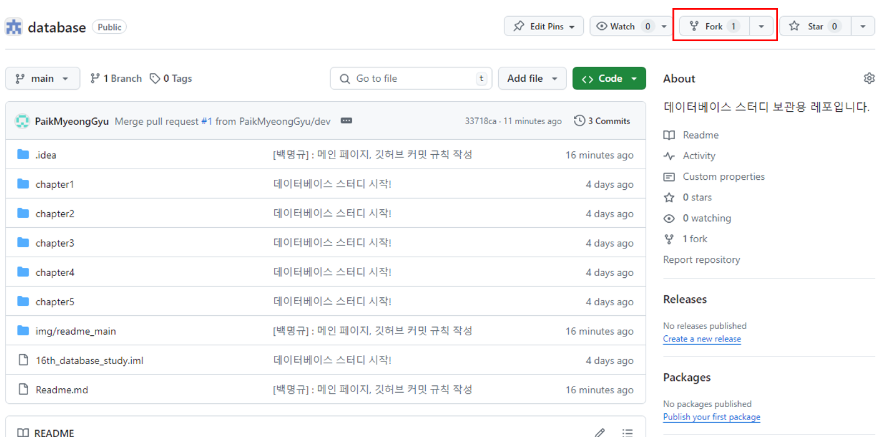
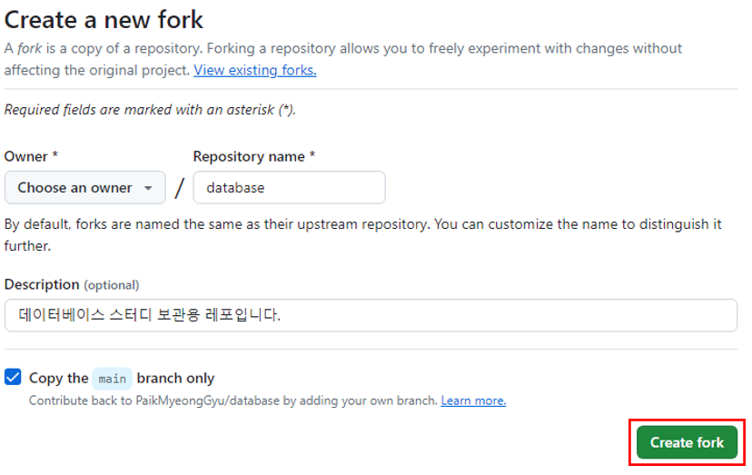
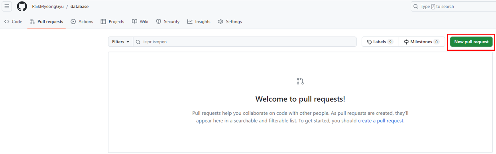
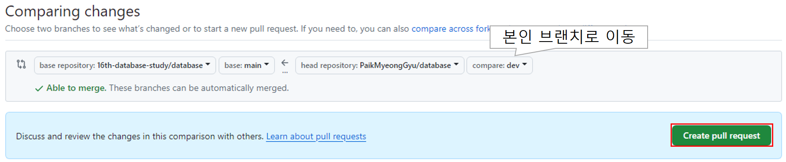
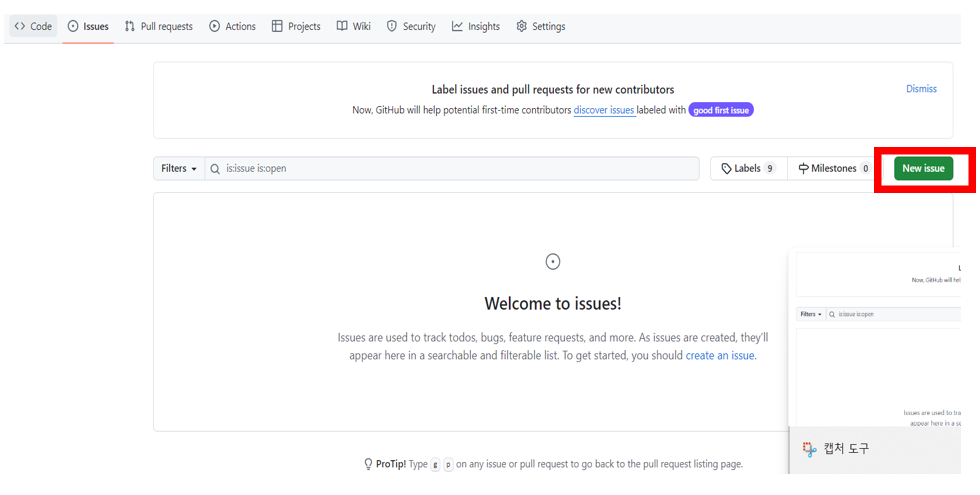
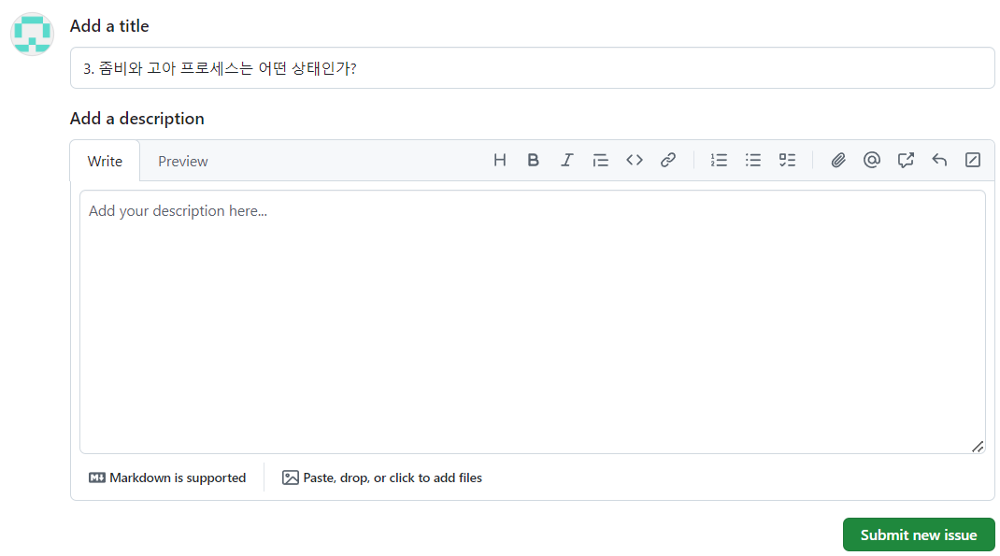
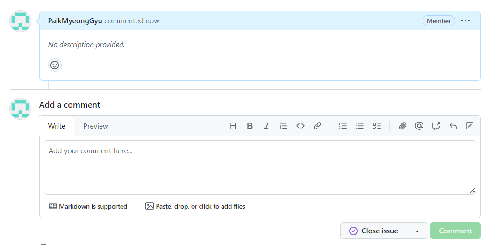

# 1. 활동 관련 규칙
## 1.1 매주 활동 내역
1. 매주 월요일 오후 6시-6시 30분까지 질문 공유하는 시간으로 비울 것
2. 매주 월요일 아침까지 해당 주차 질문 관련 학습 내용 및 이슈에 질문 답변 업로드
3. 월요일 회의 시간에 학습한 내용과 이슈 정리하여 발표 형식 공유, 이번엔 일부 주차는 온라인으로 진행 
4. 매주 월요일 끝나고 사다리타기로 4명이 정리할 내용 2개 팀으로 나눠 작성할 부분 작성
5. 토요일 23:59까지 작성 후 notion 링크 공유하기
6. 2명이서 조원끼리 모르는 내용 서로 같이 공유할 것.

※ 이전 스터디 대비 추가 조건:

본인 글의 근거는 최대한 GhatGPT와 취준 블로그보단 문서를 사용할 것

# 2. 파일 변경 관련 규칙
## 2.1 Github 내 프로젝트 클론

메인 프로젝트 fork!



fork 생성! Owner를 본인으로 놓고 생성하면 됨!



## 2.2 인텔리제이 IDE 접속 및 커맨드

따로 fork해서 dev나 뭐 아무 이름 브랜치 생성해서 PR 보내고 카톡 남기면 됨. 개인적으로 확인하고 PR 내용 보고 병합하겠음.
```shell
데이터 가져오기
> git clone [복사URL]
> git checkout -b dev
> git pull
글 작성 후
> git add -A
하단 커밋 메시지 규칙: [작성자] : 변경 주차, 간단 이유
> git commit -m [커밋 메시지]
> git push origin
```

## 2.3 PR 날리기

1. 직접 깃허브에 본인 깃허브 디렉토리로 이동

2. Pull-requests로 이동, New pull request 이동



3. Pull request 생성, 주의 사항은 본인이 작성한 페이지로 이동해야 함.



4. request 날리면 카톡으로 *** PR 확인 요청 부탁 ***

## 2.4 폴더 관리 관련 규칙
폴더 구조는 초기 네트워크 스터디에서 정한 4주 치 질문에 대한 답변을 위해 week1-4 주차 폴더 생성
각 주차 폴더 내에는 question 폴더와 내부에 image 폴더가 있음.

1. question.md에는 해당 챕터 담당자가 해당 챕터 관련 질문 내용 정리 후 업로드
2. 정리 내용 이미지는 question 폴더 내의 image 폴더에 본인 이름으로 폴더 생성 후 저장

## 2.5 이슈 관련 규칙

1. 이슈 발행!



2. 이슈 작성, 초기엔 description 비우기



3. 답글 작성, 틀린 내용 혹은 더 알아봣으면 하는 내용, 좋은 내용이 있으면 알려주기!



4. 이번엔 추가적으로 참고자료도 맨 아래 빼서 새로 만들 것.