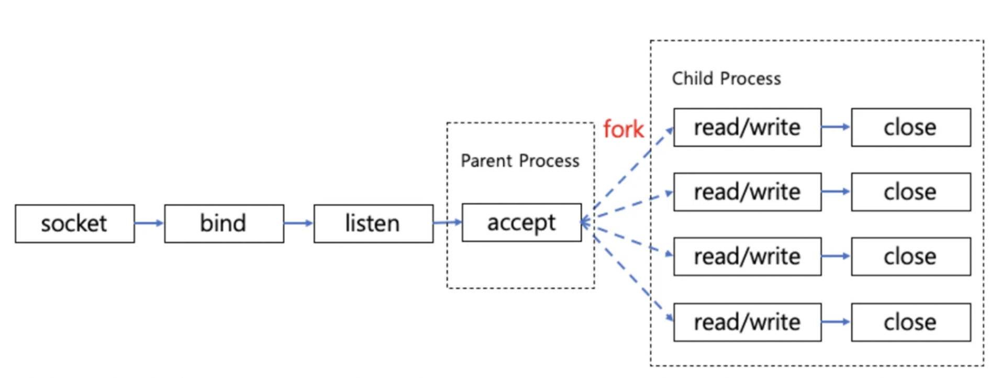
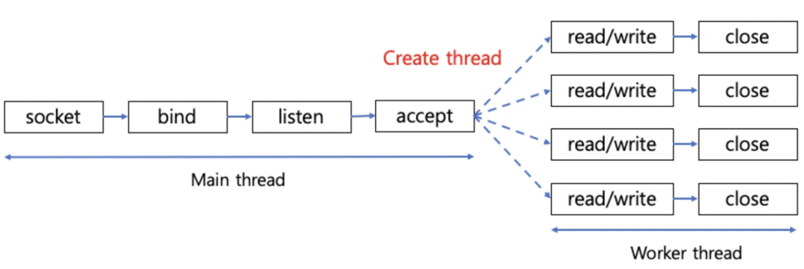
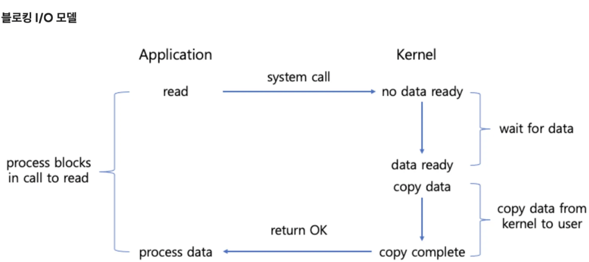
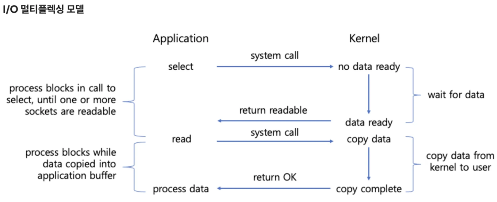
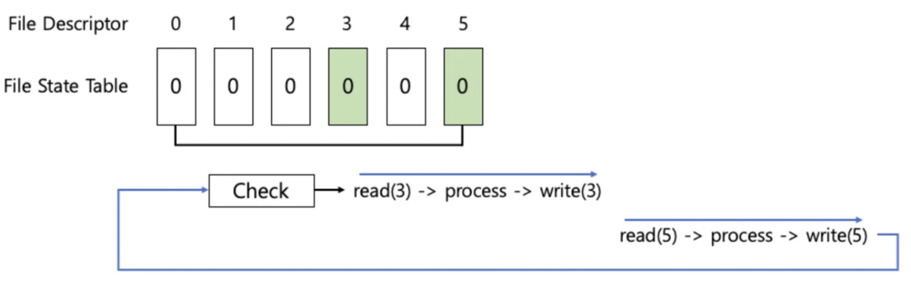

# 서버 구현 방식


## 멀티 프로세스 방식




멀티 프로세싱 기반의 다중 접속 서버의 경우 부모 프로세스에서 리스닝 소켓으로 accpet()을 호출하여 연결 요청을 수락한 후 소켓의 파일 디스크립터를 얻게 된다. 그리고 이를 자식 프로세스를 생성하면서 넘겨주고 자식 프로세스에서 요청을 처리하도록 한다.

즉 요청이 발생할 때마다 프로세스를 생성하여 작업을 처리한다.

### Code

```c++

while(1) {
        adr_sz = sizeof(clnt_adr);
        // 부모 프로세스는 리스닝 소켓으로 accept 함수를 호출해서 연결 요청을 수락한다.
        clnt_sock = accept(serv_sock, (struct sockaddr*)&clnt_adr, &adr_sz);
        if (clnt_sock == -1)
            continue;
        else
            puts("new client connected...");
        
        pid = fork();
        if (pid == -1) {
            // 부모 프로세스의 경우 바로 client 소켓을 닫고 이벤트 루프를 돈다.
            close(clnt_sock);
            continue;
        }
        if (pid == 0) {
            close(serv_sock);
            // 자식 프로세스는 전달받은 파일 디스크립터를 바탕으로 서비스를 제공한다.
            while((str_len = read(clnt_sock, buf, BUF_SIZE)) != 0)
                write(clnt_sock, buf, str_len);

            close(clnt_sock);
            puts("client disconnected...");
            return 0;
        }
        else
            close(clnt_sock);
    }
```

- 장점
  - 프로세스는 독립적인 메모리 공간을 가지고 서로 영향을 주지 않기 때문에 독립적으로 작업을 수행할 수 있다.
- 단점
  - 요청마다 fork() 시스템 콜을 통해서 프로세스를 생성하기 때문에 자원을 많이 잡아먹는다.
  - 서로 다른 독립적인 메모리를 사용하기 때문에 프로세스간 정보 교환이 어렵다.


## 멀티 스레딩 방식



멀티 스레딩 방식에서는 메인 스레드에서 리스닝 소켓으로 accpet()을 통해 요청을 수락한 후 소켓의 파일 디스크립터를 얻는다. 그리고 이를 워커 스레드를 생성하면서 넘겨주고 해당 스레드에서 요청을 처리하도록 한다.

### Code

```c++
while(1) {
        adr_sz = sizeof(clnt_adr);
        //메인 스레드는 리스닝 소켓으로 accept 함수를 호출해서 연결 요청을 수락한다.
        clnt_sock = accept(serv_sock, (struct sockaddr*)&clnt_adr, &adr_sz);

        if (clnt_sock == -1)
            continue;

        puts("new client connected...");

        //클라이언트와 연결된 소켓의 파일 디스크립터를 워커 스레드를 생성해 넘겨준다.
        pthread_create(&t_id, NULL, handle_clnt, (void*)&clnt_sock);
        pthread_detach(t_id);
    }
```

- 장점
  - 프로세스를 생성하는 비용보다는 스레드 생성 비용이 적다.
  - 스택을 제외한 메모리를 공유하기 때문에 스레드간의 정보 교환이 쉽다.
- 단점
  - 하나의 스레드에 문제가 발생하면 프로세스 내부의 모든 스레드에 영향을 줄 수 있다.
  - 멀티 프로세싱 보다는 비용이 적게 들긴 하지만 여전히 요청마다 스레드를 생성하기 때문에 여전히 많은 리소스가 필요하다.
  - 스레드 풀을 사용하여 운영하면 비용을 줄일 수 있지만 무한정 스레드를 생성할 수는 없기 때문에 요청이 많아지게 된다면 동시 처리에 문제가 발생한다.


## I/O Multiplexing





I/O Multiplexing 기법은 입출력 함수 자체는 블로킹 방식으로 동작하지만, 호출 전에 특정 파일이나 소켓에서 입출력이 가능한지 확인할 수 있다. 이를 통해 하나의 스레드가 여러 소켓을 효율적으로 관리할 수 있다. 이 방식은 커널에서 제공하는 `select`, `poll`, `epoll`, `kqueue`와 같은 시스템 호출을 활용하여 구현된다.

기존의 블로킹 I/O 모델의 경우 read와 같은 입출력 시스템 콜을 호출하면 블로킹되고 커널에 데이터가 들어오는 것을 기다리게 된다. 그리고 실제 데이터가 들어올 때까지 기다린다.

I/O Multiplexing의 경우 select, poll, epoll등의 시스템 콜을 사용해서 여러 소켓 파일을 감시하게 된다. 그리고 데이터가 들어오면 이 때 read()와 같은 입출력 시스템 콜을 호출한다. 데이터가 있는 상태에서 입출력 함수를 호출하기 때문에 바로 데이터를 처리할 수 있다.


### select 시스템 콜

select는 감시할 파일들을 fd_set 이라는 파일 상태 테이블(파일 디스크립터 비트 배열)에 등록하고, 등록된 파일(파일 디스크립터)에 이벤트가 발생하면 fd_set을 확인하는 방식으로 작동한다.



### Code

```c++
  			// result
        // -1: 오류 발생
        // 0: 타임 아웃
        // 1 이상: 등록된 파일 디스크립터에 해당 이벤트가 발생하면 이벤트가 발생한 파일 디스크립터의 수
        if ((fd_num = select(fd_max+1, &cpy_reads, 0, 0, &timeout)) == -1)
            break;

        if (fd_num == 0)
            continue;

        for (i=0; i<fd_max+1; i++) { // <- 하나씩 다 검사
            if (FD_ISSET(i, &cpy_reads)) { // fd_set 테이블을 검사한다.
```

반환값은 이벤트가 발생한 파일 디스크립터의 개수이기 때문에 어디서 이벤트가 발생했는지 하나씩 검사해야 한다. ⇒ O(N)

- 장점
  - 단일 프로세스(스레드)에서 여러 파일 입출력 처리가 가능하고 동시에 수만 개의 커넥션도 처리할 수 있다.
  - 클라이언트 요청마다 스레드를 생성하지 않기 때문에 Context Switch 오버헤드가 없다.
- 단점
  - select를 호출할 때마다 매번 관련 정보를 전달해야 한다.
  - select 결과가 이벤트 발생 디스크립터 개수이기 때문에 어디서 이벤트가 발생했는지 하나씩 확인해야 한다.
  - 검사할 수 있는 디스크립터 개수에 제한이 있다. (maximum 1024)
  - select를 호출할 때마다 데이터를 복사해야 한다. (이벤트를 처리할 때 fd_set 테이블의 변경이 필요하기 때문에 미리 복사를 해둬야 한다.)

### epoll 시스템 콜

select 의 단점을 해결할 수 있는 multiplexing 방식을 지원한다. 커널에 관찰 대상에 대한 정보를 한 번만 전달하고 관찰 대상의 범위, 내용이 변경될 때 이를 알려준다.

- 장점
  - 상태 변화를 확인하기 위해 전체를 확인할 필요가 없다.
  - 커널에 상태 정보를 유지하기 때문에 호출할 때마다 관찰 대상 정보(fd_set)을 전달할 필요가 없다.
- 단점
  - Linux epoll 기반 서버를 Window의 IOCP 기반으로 변경하는 것이 불편하다. (select는 간단)


