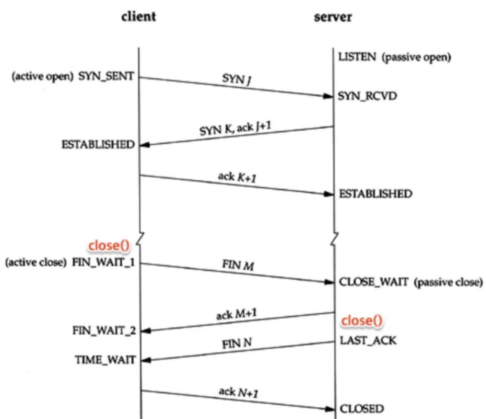
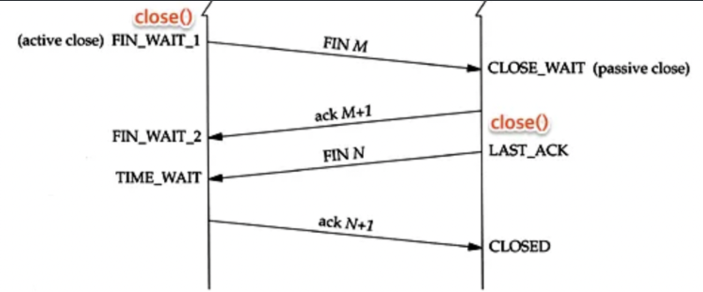
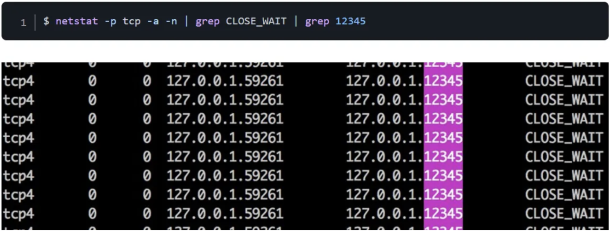

# TCP 설계로 발생할 수 있는 문제들


## CLOSE WAIT

TCP의 커넥션을 맺고 커넥션을 해제하는 과정은 아래와 같다.



위의 과정에서 client 측에서 close() 콜이 일어나고 client 측은 TIME_WAIT 상태로, server 측은 CLOSED라고 표시된 상태까지 일어나는 과정이 4-way handshake 과정이다.

이 때, 주의할 점은 client, server라고 개별적으로 분리를 해서 표현을 했지만 server와 server 사이의 통신에서는 사실상 server가 client가 될 수 있다. 그리고 client와 통신을 하더라도 server 측에서 먼저 커넥션을 끊는 client의 입장에서 동작할 수 있다는 점을 알고 넘어가야 한다.

위의 과정에서 4-way handshake 과정에서 client와 server의 상태 전이에 대해 적으면 아래와 같다.

1. close()를 실행한 client가 FIN을 보내고 FIN_WAIT1 상태로 대기한다.
2. server는 CLOSE_WAIT으로 바꾸고 응답 ACK를 전달한다. 그와 동시에 해당 포트의 애플리케이션에게 close() 요청을 보낸다.
3. ACK를 받은 client는 상태를 FIN_WAIT2 상태로 바꾼다.
4. close() 요청을 받은 서버 애플리케이션은 종료 프로세스를 진행하고 FIN을 클라이언트에 보내 LAST_ACK 상태로 바꾼다.
5. FIN을 받은 클라이언트는 ACK를 서버에 다시 전송하고 TIME_WAIT으로 상태를 바꾼다. TIME_WAIT에서 일정 시간이 지나면 CLOSED상태가 된다. ACK를 받은 서버도 포트를 CLOSED로 바꾼다.

### **TCP connection close**

TCP 커넥션 종료는 클라이언트와 서버 어느 쪽에서도 할 수 있기 때문에, 클라이언트와 서버의 상태를 고정하여 설명하는 것 보다, Active close와 Passive close 상태로 설명하는 것이 좋다.

- Active close: TCP 연결 해제 요청한 쪽. 트래픽을 전송(request)하고 정상적으로 전송 되었으면 연결을 끊는 쪽이다.
- Passive close: TCP 연결 해제 요청을 받은 쪽. 트래픽을 받는 쪽이다.

### CLOSE_WAIT 상황에서 생길 수 있는 문제점



**CLOSE_WAIT 상태가 발생하는 이유**

- **서버 측 FIN 전송**

  서버가 데이터를 전송한 뒤 `OutputStream`을 닫으면서 소켓도 닫는다. 이때 **FIN 패킷**을 클라이언트로 전송한다.

- **클라이언트 측 FIN 수신 및 ACK 반환**

  클라이언트는 서버의 FIN 패킷을 수신하고, 이에 대한 ACK 패킷을 반환하며 TCP 상태가 **CLOSE_WAIT**로 전환된다.

- **클라이언트 측에서 소켓을 닫지 않음**

  클라이언트 애플리케이션에서 `Socket.close()`를 호출하지 않아 소켓이 계속 열려 있고 리소스가 점유된 상태로 유지된다. (CLOSE_WAIT 상태 계속 유지)

위를 간단하게 요약하면 Passive close하는 쪽에서 FIN을 받고 ACK는 보냈는데 애플리케이션 쪽에서 close()를 제대로 하지 못해 종료됐다는 신호를 받지 못한 것이다. CLOSE_WAIT는 timeout 설정이 불가능해서 애플리케이션을 강제 종료 시키는 것이 아니라면 해당 상태에서 벗어나는 것이 어렵다.

CLOSE_WAIT 때문에 서버가 정상 동작하지 않는다면 다음과 같은 특징이 있다. 애플리케이션 모니터링 과정에서 CPU랑 메모리 사용량에는 이상이 없는데 요청에 대한 처리가 잘 되지 않으며, window에서는 아래의 명령어를 통해 아래와 같은 결과를 확인할 수 있다.



위의 문제가 일어나는 상황은 내부 서버에서 응답과 요청을 동시에 보낼 때 트래픽이 커져서 애플리케이션 자체 내에서의 교착상태가 돼버리면 close를 호출하지 못해 일어난다고 한다.
→ 트래픽이 커지면 nginx를 통해 톰캣 내에서 톰캣 내부로 요청을 보내는 요청으로 동작하게 만드는 게 아니라 외부 요청으로 바꿀 수 있게 응답 소스를 내리는 서버를 분리할 필요가 있다.
→ TCP 자체의 문제보다는 애플리케이션의 비정상적인 행동으로 인해서 발생하는 문제이다.

위의 CLOSE_WAIT 문제를 통해서 아래와 같은 TCP 설계의 근본적인 문제를 찾아볼 수 있다.

### TCP 설계-근본적인 문제로 해석할 수 있는 부분?

TCP의 설계는 연결의 신뢰성과 상태 관리에 중점을 두고 있지만, **상태 유지 기반** 설계인 만큼 몇 가지 한계가 있다.

- **응용 프로그램 의존성**: TCP는 상태를 관리하지만, 상태 전환의 최종 책임은 응용 프로그램에 있으므로 프로토콜에 대한 이해와 적절한 처리가 동반되어야 한다.
- **자원 누수 문제**: TCP는 리소스 관리에서 응용 프로그램의 협조를 필요로 하기 때문에, CLOSE_WAIT와 같은 문제가 발생하면 시스템 전체에 영향을 줄 수 있다. 따라서, 자원 누수를 방지하기 위한 응용 프로그램단에서의 리소스 관리가 중요하다.
- **자동 회복 부재**: CLOSE_WAIT 상태를 일정 시간 후 자동으로 해제하는 메커니즘이 TCP 수준에서 제공되지 않는다. 회복을 위한 추가적인 매니징이 필요하다.


## TIME WAIT

위의 CLOSE_WAIT는 애플리케이션 내부에서 응답과 요청을 동시에 하는 등의 문제로 애플리케이션 내에 교착상태가 발생해 애플리케이션에서 연결을 끊었다는 신호를 받지 못할 때 일어났다. 즉, **TCP의 설계의 애플리케이션에 대한 의존도에 의해 벌어지는 것**이며 이는 TCP 자체의 문제가 아니다. 하지만 TIME_WAIT는 TCP 스펙 자체의 문제이다.

[](https://private-user-images.githubusercontent.com/106337673/389370269-d7a39a38-47d6-4f97-ac79-050651f91f4d.png?jwt=eyJhbGciOiJIUzI1NiIsInR5cCI6IkpXVCJ9.eyJpc3MiOiJnaXRodWIuY29tIiwiYXVkIjoicmF3LmdpdGh1YnVzZXJjb250ZW50LmNvbSIsImtleSI6ImtleTUiLCJleHAiOjE3MzM0Njk4MTQsIm5iZiI6MTczMzQ2OTUxNCwicGF0aCI6Ii8xMDYzMzc2NzMvMzg5MzcwMjY5LWQ3YTM5YTM4LTQ3ZDYtNGY5Ny1hYzc5LTA1MDY1MWY5MWY0ZC5wbmc_WC1BbXotQWxnb3JpdGhtPUFXUzQtSE1BQy1TSEEyNTYmWC1BbXotQ3JlZGVudGlhbD1BS0lBVkNPRFlMU0E1M1BRSzRaQSUyRjIwMjQxMjA2JTJGdXMtZWFzdC0xJTJGczMlMkZhd3M0X3JlcXVlc3QmWC1BbXotRGF0ZT0yMDI0MTIwNlQwNzE4MzRaJlgtQW16LUV4cGlyZXM9MzAwJlgtQW16LVNpZ25hdHVyZT03ZjYzY2UxOGFkYjcxYzZiNWNiNTczYTI2NDUwNGQzZTc1Yjc3MGZiMmNiODI4ZGZhNWYwZWRlNmI1NGEyMzBjJlgtQW16LVNpZ25lZEhlYWRlcnM9aG9zdCJ9.Fcj4rGYs9tD9I9ONDYGwhkspo1UQLFt21hoBAR1jI3w)

**TIME_WAIT까지 이르는 과정**

- 우선 4-way handshake에서는 server 측에서 FIN으로 애플리케이션 내에서 TCP 연결이 종료되었음을 완료하고 FIN응답을 client 측으로 보낸다.
- 해당 응답을 받고 client 측에선 TIME_WAIT 상태로 간 뒤 ACK를 보낸다.
- TCP 스펙 자체에서는 지연 패킷이 발생한 경우와 ACK가 손실한 경우를 대비하기 위해서 종료를 요청한 측에선 TIME_WAIT 동안 대기한다.

위의 TIME_WAIT는 OS에 대해서 종속적으로 설정이 되어있으며 스펙마다 다르며 애플리케이션에서 설정이 불가능하다. 게다가, 대략 1분 정도의 시간으로 매우 길다는 문제가 있다. 이게 위의 4-way handshake에서의 연결을 종료하는 측이 서비스 이용 고객이라면 괜찮지만 서버와 서버 사이의 통신이라면 문제가 생긴다. 정상적으로 종료가 되었음에도 불구하고 프로세스를 종료해도 TIME_WAIT 상태로 소켓이 이전에 사용하던 포트를 해당 시간이 종료될 때까지 계속 붙잡고 있기 때문에 재시작도 불가능하다. bind 단계에서 오류가 발생하기 때문이다.

또한, 서로 동일한 시점에 연결된 양쪽 모두가 Active close(client 측의 종료 요청)을 시도하면 둘 다 TIME_WAIT 상태로 남아있을 수 있다. FIN을 보낸 뒤 CLOSE_WAIT과 다르게 FIN_WAIT는 응답이 안와도 이후의 단계로 timeout이 지나면 이동이 되게 설정이 되어있기 때문이다.

이 문제는 서버 투 서버로 1:1 대용량 접속이 발생하는 경우이며, 그 이유는 Linux 운영체제를 기준으로 할당할 수 있는 포트의 범위가 32768이기 때문이다. 그러면 대략 60초 동안 TIME_WAIT를 한다는 가정하에 사양이 아무리 좋더라도 한 대의 클라이언트에서 가능한 최대 요청 수는 최대 500 RPS(Requests per second)을 넘을 수 없다는 계산이 나온다. 하지만, 추가적인 내용을 보면 꼭 그렇지 않다는 걸 알 수 있다.

### **다수의 TIME_WAIT은 정말 시스템 성능 저하를 가져오는가?**

```
- 과거 논문 결과에서는 메모리 사용으로 인한 성능 저하가 있었으나, 현재는 서버 메모리 용량에 미치는 수준이 미미하다. (→ 더 이상 메모리의 문제는 아님)
- 대량의 TIME_WAIT (약 9만개의 `TIME_WAIT` 상태) 이 있더라도 서버가 포트를 할당하는 것이 아니라 소켓을 할당하기 때문에 로컬 포트 ((2^16)-1 = 65,535개가 최대) 개수보다 더 많은 TIME_WAIT 상태를 만들 수 있다.
```


### 대비책

**재활용**

TIME_WAIT 상태로 된 포트를 재사용할 수 있다. 이는 클라이언트가 net.ipv4.tcp_tw_reuse 옵션을 활용해 TIMM_WAIT 상태로 남아있던 소켓을 재사용할 수 있게 옵션을 설정해야 한다.

**타임스탬프**

패킷이 오작동을 막기 위해 TIME_WAIT라는 걸 만들었는데, 타임스탬프를 사용해서 지연 패킷이 발생하는 경우엔 이미 지난 타임 스탬프를 확인해 버리면 된다.

ACK를 수신하지 못한 경우엔 새로운 커넥션이 SYN을 보냈을 때 타임스탬프를 비교해 무시할 것이고 FIN이 재전송됐을 때 이미 SYN으로 연결이 된 커넥션이 있는 소켓임을 알려줌으로써 서버는 RST를 받아 LAST_ACK를 빠져나온다.


