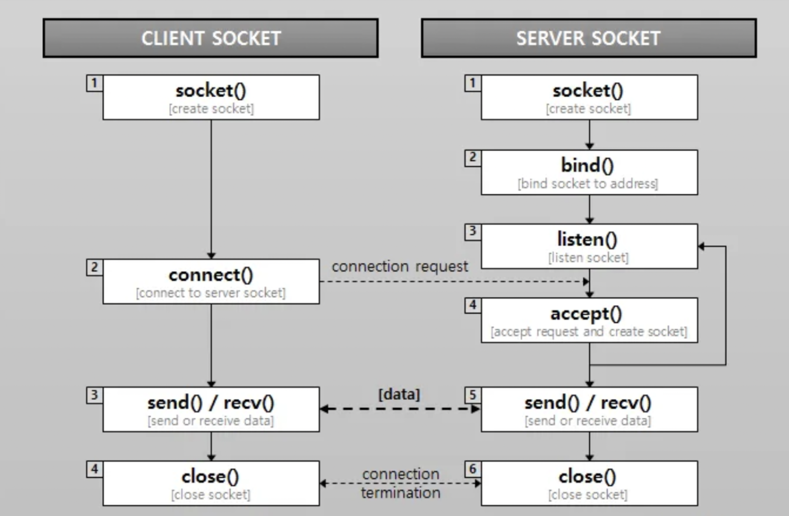
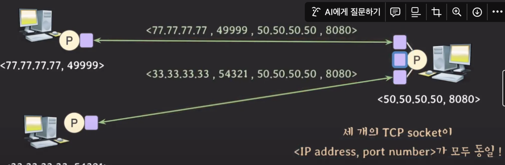

# 소켓이란?

## 소켓과 포트

소켓은 네트워크 통신을 위한 통로의 양 끝 출입구 역할을 하는 일종의 **파일**이다. `socket()` 호출을 통해 소켓이 생성되면 파일 디스크립터가 반환된다. 이후 데이터를 전송하기 위해 `write()`, `read()` 시스템 콜을 호출할 때 파일 디스크립터를 파라미터로 전송하여 어떤 소켓을 사용해 통신할지 결정한다.

포트는 동일한 IP 주소 내에서 애플리케이션(프로세스)을 구분하기 위해 사용하는 식별자이다. 주로 클라이언트에서 서버 측의 소켓을 구분할 때 사용한다.

소켓은 소켓 주소를 통해 식별 가능하다. 소켓 주소는 (전송 프로토콜, IP 주소, 포트 번호)로 이루어져 있다. 소켓 간에 통로의 반대편, 즉 통신 상대를 구분하기 위해 소켓 주소를 사용한다.

- **IP 주소**: 네트워크 상에서 특정 호스트(컴퓨터, 서버, 네트워크 장치 등)를 식별
- **포트 번호**: 호스트 내에서 특정 애플리케이션(프로세스)을 식별
- **프로토콜**: 전송 방식(TCP 또는 UDP)을 결정

## 3. 소켓 통신 과정

### 3-1. socket()

미리 소켓의 형태를 잡아 소켓을 만드는 시스템 콜이다.

- **domain**: IPv4, IPv6중 무엇을 사용할지 결정
- **type**: stream, datagram 소켓 중 선택
- **protocol**: 0, 6, 17 중 선택 (0은 운영체제가 자동으로 선택, 6은 TCP, 17은 UDP)

### 3-2. bind()

생성한 소켓에 실제 IP 주소와 포트 번호를 부여하는 시스템 콜이다. 주로 서버 측의 소켓에서 사용하며, 클라이언트에서 특정 로컬 IP 주소나 포트를 명시적으로 지정하려는 경우에도 사용한다.

- **sockfd**: 바인딩을 할 소켓의 파일 디스크립터
- **sockaddr**: 소켓에 바인딩 할 아이피 주소, 포트번호를 담은 구조체
- **socklen_t**: 위 구조체의 메모리 크기

### 3-3. listen()

서버 측의 소켓이 클라이언트의 연결 요청을 받아들이도록 한다. 파라미터로 받은 backlog만큼의 크기를 갖는 backlog queue를 만든다. 이는 서버가 동시에 처리할 수 있는 최대 연결 요청 대기 수를 의미하며, 큐가 가득 차면 추가 연결 요청은 거절된다. `listen()` 시스템콜은 연결 수립이 필요한 TCP에서만 사용한다.

서버 측의 소켓은 `listen()` 호출 이후 클라이언트의 연결 요청을 받아주기 위해 backlog queue를 가진 채로 기다린다. 클라이언트가 서버에 보낸 요청들은 모두 backlog queue에 저장된다.

- **sockfd**: 소켓의 파일 디스크립터
- **backlog**: TCP의 backlog queue의 크기

### 3-4. connect()

파이프를 연결하는 것처럼 클라이언트의 소켓과 서버의 소켓을 연결한다. IP 주소와 포트 번호를 사용해 상대 측의 소켓을 지정하고 연결 요청을 보낸다. `connect()`는 일반적으로 블로킹 호출로 작동하며, 연결이 성공하거나 실패할 때까지 호출이 반환되지 않는다.

### 3-5. accept()

backlog queue에서 대기 중인 연결 요청을 처리하여 **새로운 소켓을 생성**하고 이를 클라이언트의 소켓과 연결한다. 이 과정에서 생성된 개별 소켓은 클라이언트와 서버 간의 데이터 송수신을 담당하며, 서버의 메인 소켓은 다른 연결 요청을 받기 위해 계속 유지된다. 이렇게 연결 요청 처리와 데이터 송수신 작업을 분리함으로써 병목 현상을 막을 수 있다.

- **sockfd**: 백로그 큐의 요청을 받아들이기 위한 소켓의 파일 디스크립터
- **sockaddr**: 큐에서 꺼낸 연결 요청에서 가져온 클라이언트의 주소 정보
- **socklen_t**: 위 구조체의 메모리 크기

### 3-6. send() / recv()

소켓 연결이 수립된 후 데이터를 송수신하는 시스템 콜이다. `send()`는 ****데이터를 송신 버퍼로 전달하여 상대 소켓으로 전송하고, `recv()`는 수신 버퍼에서 데이터를 읽어 애플리케이션으로 전달한다.

### 3-7. close()

데이터 송수신이 종료되면 소켓을 닫기 위해 사용하는 시스템 콜이다. `close()`에 의해 닫힌 소켓은 유효하지 않기 때문에, 더 이상 해당 소켓을 사용하여 데이터를 송수신할 수 없다.

## TCP / UDP & 소켓

UDP의 경우 (Protocol, dest IP Address, dest Port Number)만으로도 송신측의 소켓을 유일하게 식별할 수 있고 데이터 전송이 가능하다.

하지만 TCP의 경우 동일한 (IP, Port Number)를 가진 소켓이 많이 존재하기 때문에 불가능하다. 구현상으로 accept() 시스템 콜의 반환값으로 클라이언트와 소통하는 새로운 소켓을 생성하여 이를 통해서 통신이 이뤄지기 때문이다.

때문에 TCP에서는 소켓을 식별하기 위해서 (src IP, src Port Number, dest IP, dest Port Number)가 필요하다.

