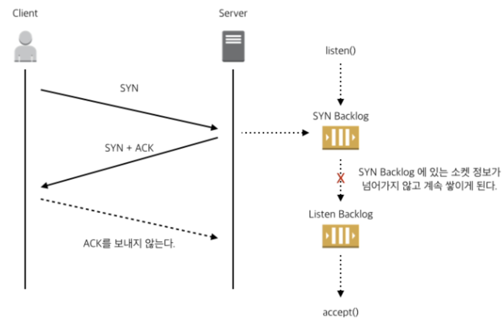

# SYN Flooding

## SYN Flooding이란?

- TCP는 연결 지향 프로토콜로, 통신을 시작하기 위해 **3-way handshake** 과정을 거친다. 이 과정에서 클라이언트는 서버로 `SYN` 패킷을 보내고, 서버는 클라이언트로 `SYN-ACK` 패킷을 응답한 뒤, 클라이언트가 `ACK`를 다시 보내야 연결이 완료된다.
- 서버가 처음 listen() 시스템 콜으로 소켓을 만들면 커널에서는 SYN Backlog, Listen Backlog 라는 두 개의 큐를 만들게 된다. 그 후 클라이언트의 커넥션 요청인 `SYN` 패킷이 들어오면 해당 소켓 정보를 SYN Backlog 에 저장하고 곧바로 `SYN-ACK` 를 클라이언트로 보낸다. 이 때 해당 소켓은 SYN_RECV 상태가 된다.
- 다음으로 클라이언트가 `ACK` 패킷을 보내게 되면 해당 소켓의 정보는 Listen Backlog로 옮겨진다. 그리고 서버에서 accept() 시스템 콜이 호출되면 해당 소켓은 최종적으로 Established 상태가 되어 Backlog 큐에서 빠져 나와 TCP 통신을 위한 준비를 한다.
- 하지만, 클라이언트가 `SYN-ACK` 에 대한 응답인 `ACK` 를 보내지 않으면 SYN Backlog에 계속 소켓 정보가 넘어가지 않고 쌓이게 되어서 더 이상 소켓의 정보를 저장할 수 없게 된다. (SYN Drop) . 즉, 악의적으로 `SYN` 계속 보낸다면 서버의 SYN Backlog를 가득 채워 더 이상 신규 커넥션을 받을 수 없게 된다.

### 방지 방법

##### **SYN 쿠키(SYN Cookie)**

위와 같이 SYN Flooding 공격을 받을 때, SYN Cookie 기능을 켜면 서버는 더 이상 SYN 패킷들을 SYN Backlog에 저장하지 않는다. Backlog에 저장하는 대신 SYN 패킷에 있는 정보들(클라 IP, timestamp, mss 값 등)을 사용해 쿠키를 만들고, 그 값을 `SYN-ACK` 의 ISN (Initial Sequence Number) 로 만들어서 클라이언트에게 다시 보낸다.

이 후, 클라이언트가 정상적으로 보낸 `ACK`를 서버가 다시 받아서 Sequence Number를 추출한다. 이 숫자가 자신이 만든 숫자가 맞는지 검증을 한 뒤, 정상적인 패킷이라고 판단되면 Listen Backlog로 넘겨서 커넥션을 맺을 준비를 한다.

서버는 `SYN` 요청을 받을 때 임시로 연결 상태를 저장하지 않고, 응답에 특정 값을 포함시킨다. 클라이언트가 정상적으로 ACK 를 보내올 때 이 값을 검증하여 연결을 수립한다.

##### SYN 쿠키를 활성화하고 있을 때, 추가 가능한 SYN Flooding 대처 방법

네트워크 트래픽에서 `SYN Flooding`이 발생하면, 특정 포트로 들어오는 TCP 연결 요청이 과도하여 시스템이 SYN 쿠키가 활성화 되었음을 로그로 남긴다.

( +또한, 서버가 새로운 TCP 연결 요청을 거부하거나 지연되거나 많은`SYN-RECV` 상태가 보이는 것이 특징이다.)

따라서, 현재 들어오고 있는 수많은 요청 트래픽이 정상 트래픽인지 악성 트래픽(공격) 인지 확인하는 과정이 필요하다.

##### **트래픽 분석: 정상인지 악성인지 확인**

**정상 트래픽인 경우**

- `netstat -nta | grep "State|<포트번호>"` 또는 `ss -nta '( dport = :<포트번호> )'` 명령으로 소켓 상태 확인
- 정상적인 클라이언트 IP인지 확인
- 의심스러운 패턴: `SYN` 패킷만 들어오고 응답이 없는 경우 공격일 가능성이 높다.

##### **악성 트래픽인 경우**

- 공격 IP 차단 및 방화벽 설정 추가

##### **정상 트래픽인데 그저 요청이 많을 뿐이었다면..?**

- 애플리케이션 및 커널 설정을 조정을 통한 처리 용량 확대
- 백로그 크기 증가 (SYN Backlog, Listen Backlog)

##### 추가 방지법

1. 방화벽 및 외부 DDoS 방어 솔루션
   - 비정상적으로 많은 `SYN` 요청을 필터링하여 서버에 도달하지 못하게 한다.
   - Third Party 서비스, 특히 클라우드 서비스를 통해 막을 수도 있다.
   - 클라우드에서 핸드셰이크 프로세스를 처리하여 TCP 핸드셰이크가 완료될 때까지 표적 서버(DDos 공격의 표적이 될 수 있는 서버) 와의 연결을 보류할 수 있다.
2. 백로그 큐(backlog queue) 관리
   - 운영체제 레벨에서 backlog 크기를 늘리거나 특정 시간 이후 자동으로 제거하도록 설정하여 backlog가 꽉 차지 않게 만든다.

