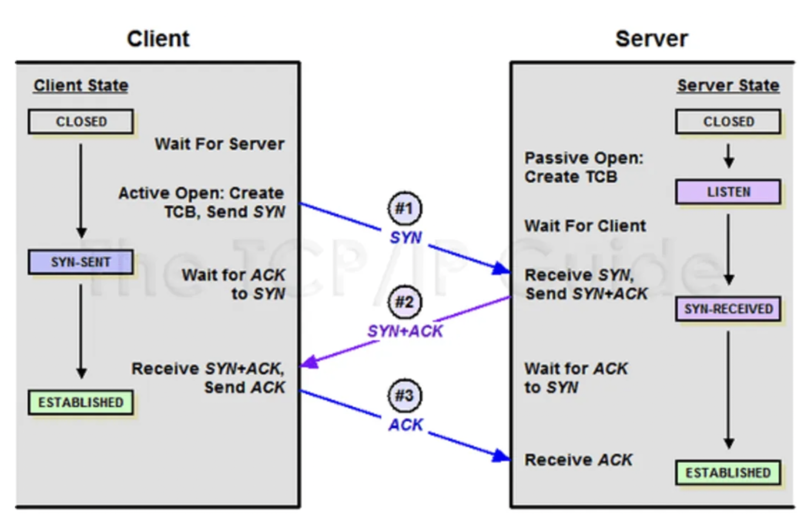
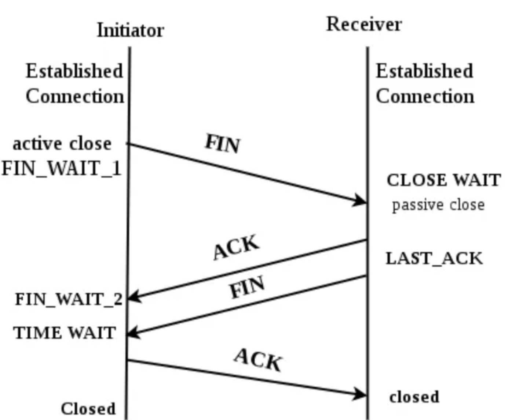

# 3, 4 way handshake

## **3-Way Handshake**

3-way handshake 과정을 통해서 TCP 연결을 수립한다.

### 과정

1. 서버에서 listen() 시스템 콜을 호출하고 클라이언트의 요청을 대기한다.
2. 클라이언트에서 연결을 수립하기 위해 SYN 요청을 보내고 SYN-SENT 상태가 된다.
3. 서버는 SYN 요청을 받고 SYN, ACK를 클라이언트로 전송하고 SYN-RECEIVED 상태가 된다.
4. 클라이언트는 SYN, ACK를 받고 ACK를 보낸 후 ESTABLISHED 상태가 된다.
5. 서버는 ACK를 받고 ESTABLISHED 상태가 된다.

→ 클라이언트는 4번에서 ESTABLISHED 상태가 되기 때문에 이후 SEND를 할 수 있게 된다.

## **4-Way Handshake**

4-way handshake 과정을 통해서 TCP 연결을 해제한다.

1. Initiator에서 FIN 요청을 보내고 FIN_WAIT_1 상태로 바뀌고 Receiver로부터의 ACK를 기다린다.
2. Receiver는 FIN 요청을 받으면 ACK를 보내고 CLOSE WAIT 상태로 바뀐다.
3. Initiator는 ACK를 받고 FIN_WAIT_2 상태가 되고 Receiver로부터 FIN 요청이 오기를 기다린다.
4. Receiver는 연결을 끊을 준비가 되면 FIN 요청을 보내고 LAST_ACK 상태로 넘어간다.
5. Initiator는 ACK를 보내고 TIME WAIT 상태에서 기다리다가 Closed 상태로 넘어간다.
   1. TIME WAIT은 대체로 30초, 1분 또는 2분이다.
   2. ACK가 손실되면 재전송한다.
6. Receiver는 ACK를 받고 Closed 상태로 넘어간다.