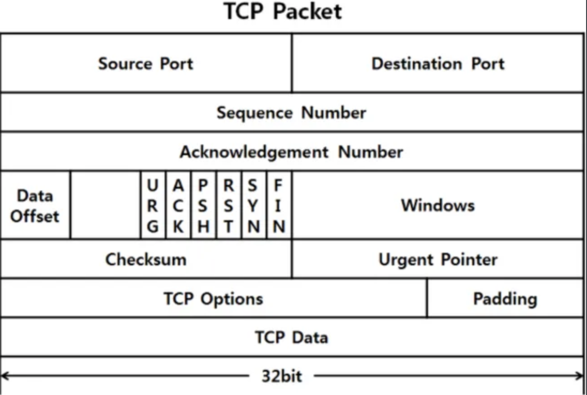

# TCP packet

TCP 패킷의 모양은 위와 같이 생겼으며 각각의 설명은 다음과 같다.

* Source Port와 Destination port (16 비트)
  * 송신 포트와 수신 포트로 상대방의 TCP 연결을 구분하기 위해 사용된다.

* Sequence Number(32 비트)
  * 커넥션을 맺고 나서 보낸 패킷의 순서에 관해서 기록함으로써 이 부분을 통해 순서 제어를 한다.

* Acknowledgment number (32 비트)
  * ACK 플래그가 설정이 된 경우 수신자가 예상하는 다음 시퀀스 번호를 의미한다.

* Data offset(4 비트)
  * TCP 헤더 크기의 값이다. 32-bit 워드 단위로 나타내며 최소 크기는 5워드 최대는 15워드라 20~60바이트가 된다.

* Flag(9 비트)

  * 전송과정에서 Control을 위한 것으로 이런 비트들이 있다. 그래서 Control bits라고도 불린다.

  * NS, CWS, SYN, ACK, URG, PSH, RST, SYN. FIN와 같은 필드가 있으며 다 알 필요는 없지만 수신과 관련해서 이미 커넥션이 맺어진 경우 커넥션이 맺어지지 않은 곳에서는 RST를 날린다는 것만 알아두면 좋을 것 같다.

* Window size(16 비트)
  * 수신 윈도우의 크기로 해당 세그먼트의 송신측이 수신하고자 하는 윈도우 크기이다.

* Checksum(16비트)
  * 헤더 및 데이터 에러 검증용 비트

## 1GB의 파일을 TCP를 통해 전송하면 TCP 패킷은 총 몇 개가 날아갈까요?

네트워크에서는 MTU라는 네트워크에 연결된 장치가 받아들일 수 있는 최대 데이터 패킷 크기가 정해져있다. 해당 MTU 값을 넘는 패킷은 해당 네트워크를 통과하지 못한다는 특징이 있다. 하지만, 패킷을 쪼개면 더 작게 만들 수 있으므로 작게 나누면 전송은 가능하다.

TCP 패킷 자체의 최대 크기는 64KB이지만 네트워크 리소스의 최대 전송 단위 (MTU)에 의해서 제한된다. 일반적으로 최대 MTU 크기는 1500Byte이고 IP헤더와 TCP 헤더의 크기 40Byte를 빼서 각 패킷은 1460Byte가 최대이다. 중간에 MTU가 낮은 곳이 있다면 조각화가 진행되거나 하는 추가작업이 일어난다.

그리고, 수신측이 받을 수 있다고 말하는 양에 대해서도 제한이 있다. 그래서 사실상 소켓이 받을 수 있는 데이터(페이로드)는 receive window, congestion winow, MSS(Maximum Segment Size) 중의 최대 값으로 판별할 수 있다.