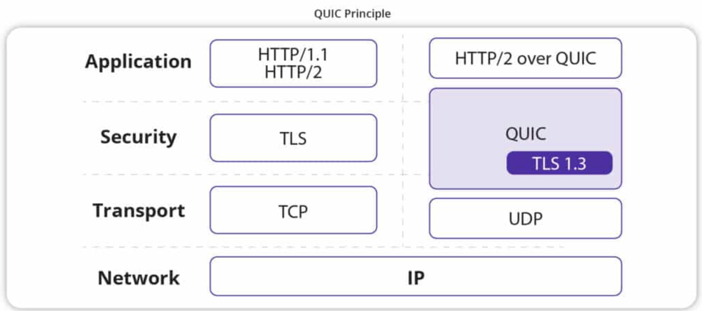

# TCP-UDP

## **TCP의 특징**

- 연결 지향 프로토콜로, 신뢰성 있는 데이터 전송 보장
- 패킷 손실 시 재전송, 데이터 흐름 제어 및 혼잡 제어 기능 포함
- **장점**: 데이터 무결성 보장, 순서 보장
- **단점**: 오버헤드가 크며, 실시간성이 필요한 서비스에는 부적합

## **UDP의 특징**

- 비연결 지향 프로토콜로, 신뢰성이 보장되지 않음
- 패킷 손실 및 순서 변경이 발생할 수 있으나, 속도가 빠름
- **장점**: 실시간 데이터 전송에 적합, 낮은 오버헤드
- **단점**: 데이터 무결성 및 순서를 보장하지 않음

## TCP를 사용할 수 없는 경우

- DHCP(Dynamic Host Configuration Protocol)

  - DHCP는 동적으로 호스트 구성을 하는 프로토콜이다.
  - 장치가 네트워크에 연결될 때에 IP 주소를 수동으로 할당 받는 것이 아닌 자동으로 할당 받을 수 있게 해준다.
  - TCP의 특징에 대해 생각해보면, 커넥션을 위해서 본인의 IP주소와 Port 정보, 상대방의 IP주소와 Port정보가 필요하다. 즉, IP 주소가 아직 할당이 안됐을 때는 TCP 연결을 사용할 수 없다.
  - 그래서 UDP를 통해서 목적지를 255.255.255.255로 설정하고, 출발지를 0.0.0.0으로 둬서 브로드캐스트 하고 응답에 대해서 처리하는 방식으로 동작한다.
  - DHCP에서 아예 TCP 연결을 사용할 수 없는 것은 아니고, 위 상황처럼 IP가 동적 할당 중에 아직 할당 되지 않았을 경우에는 사용할 수 없는 것이다. IP 할당 이후에는 사용 가능하다고 한다.

- **실시간성 요구**: 비디오 스트리밍, 온라인 게임 등, 패킷 손실을 허용하면서도 낮은 지연을 요구하는 경우

- **단순 데이터 전송**: DNS 조회, Syslog 등 신뢰성보다 빠른 속도가 중요한 서비스

- VPN 프로토콜을 구성할 때 UDP 프로토콜을 많이 사용한다.

  - VPN에는 따로 보안 프로토콜 계층이 구성되어 있어 (예: **IPSec**, **DTLS**) 이미 데이터의 신뢰성과 무결성을 보장하므로, **TCP의 추가적인 오류 제어가 필요하지 않다.**
  - 보통 사람들이 VPN을 사용할 때, 실시간성을 요구하는 서비스를 목적으로 사용하므로 속도 측면이 매우 중요하다. (온라인 게임, 스트리밍 서비스 등)

- HTTP 3.0에서 성능 향상을 위한 QUIC (Quick UDP Internet Connection) 프로토콜 도입

  

  - Google이 2012년에 개발을 시작한 새로운 인터넷 전송 프로토콜.

  - QUIC은 UDP의 속도에 TCP를 대체하면서도 보안과 신뢰성을 탑재한 솔루션을 만들고자 개발되었다.

  - 현대 웹 페이지 및 모바일 환경을 고려했을 때 페이지 및 파일 로드 시간을 줄이고자 개발되었다.

  - QUIC의 기본 구조

    QUIC은 UDP를 기반으로 하지만, 그 위에 TCP와 유사한 기능들이 구현되어있다. 불안정한 UDP 위에 신뢰할 수 있는 관리 시스템을 덧붙인 것과 같다.
  
    1. **전송 계층**: UDP를 사용하여 기본적인 데이터 전송을 담당
    2. **보안 계층**: TLS 1.3을 통합하여 모든 통신을 암호화
    3. **신뢰성 계층**: TCP와 유사한 신뢰성 메커니즘을 구현
    4. **멀티플렉싱 계층**: 여러 개의 독립적인 스트림을 하나의 연결에서 처리