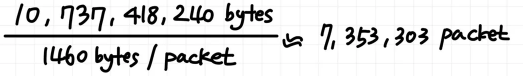

## HTTP 1.0, 1.1, 2.0, 3.0에서 각각 10GB의 파일을 보냈을 때, 총 몇 번의 Handshake가 일어나고 몇 개의 TCP packet이 날아갈까?

### 1. **기본적인 조건을 기반으로 계산**

- **파일 크기**: 10GB = 10 * 1024 * 1024 * 1024 = 10,737,418,240 bytes
- **MTU 크기**: 일반적으로 **1500 bytes**, IP 헤더(20 bytes), TCP 헤더(20 bytes)를 제외하면 **1460 bytes**가 데이터(페이로드)로 전송
- **전송할 데이터 패킷 크기**: 한 번에 전송할 수 있는 데이터는 **1460 bytes**가 최대

### 2. HTTP 1.0 에서

- 10GB 파일을 전송하기 위해, 매번 새로운 TCP 연결을 열고 닫는 과정이 반복된다.
- 각 요청마다 새로운 연결을 열기 위한 3-way-handshake가 발생하고, 연결을 끊는데 4-way-handshake가 발생하여 총 7개의 패킷이 연결마다 추가된다.

### 3. HTTP 1.1 에서

- 1.1 버전에서 10GB를 다 보낼동안, keep-alive 상태라고 가정하면, 이전의 1.0에서 발생한 연결을 열고 닫는 과정의 반복이 사라진다.
- 사실 10GB를 다 보내는 동안 연결이 한 번도 안끊길거라고 가정하기 어렵기 때문에 연결을 추가로 맺고 끊기 위한 추가 패킷 발생 가능성
- 즉, 처음에 연결을 위한 3-way-handshake, 마지막에 연결을 끊는 4-way-handshake 만 발생하여 전체적으로 7개의 패킷만 더하면 된다.
 → 7,353,303 + 7 = 약 **7,353,310** 패킷

### 4. HTTP 2.0에서
    
- 기본적으로 범용적인 TLS 1.2 버전의 보안 계층을 사용한다고 가정하면, TLS handshake 과정도 필요하다.
- 이전과 동일하게 연결의 맺고 끊음에서 발생하는 패킷 7개 + TLS handshake 과정에서 4개 = 대략 11개
- TLS 암호화 설정에 사용되는 패킷
    1. `Client Hello` → 1개
    2. `Server Hello + Certificate + ServerHelloDone` → 1개
    3. `ClientKeyExchange + ChangeCipherSpec + Finished` → 1개
    4. `ChangeCipherSpec + Finished` → 1개
 → 7,353,303 + 11 = 약 7,353,314 패킷
        
여기까지는 TCP 기반의 연결으로, TCP 소켓 내부 동작원리, 흐름 제어를 추가로 고려할 수 있다.
        
### 1. **소켓 버퍼(Socket Buffer)**
        
- 송신 측과 수신 측 모두 데이터 전송을 위해 소켓 버퍼 사용
- **송신 버퍼**: 보낼 데이터를 임시로 저장
- **수신 버퍼**: 받은 데이터를 임시로 저장
- 버퍼 크기 제한 때문에 한 번에 전송 가능한 데이터가 제한될 수 있다.
- 파일 크기가 소켓 버퍼 크기를 초과하면 소켓 버퍼에서 데이터를 여러 번 나눠 전송한다.
- 즉, 한 번에 전송 가능한 데이터가 소켓 버퍼 크기(MSS에 따른 값)로 제한되므로, **추가적인 전송 지연**이나 **더 많은 ACK 패킷**이 발생할 수 있다.
        
### 2. **슬라이딩 윈도우(Sliding Window)**
        
- TCP는 슬라이딩 윈도우 알고리즘을 사용해 **수신자의 수신 버퍼 크기**와 네트워크 상태에 따라 송신 데이터를 조정한다.
- 송신자가 한 번에 보낼 수 있는 데이터 크기를 윈도우 크기로 제한.
- 수신 측이 보내는 ACK 에 따라 슬라이딩 윈도우 크기가 동적으로 변화
        
### **슬라이딩 윈도우와 패킷 수**
        
- 슬라이딩 윈도우 크기가 작다면, 더 적은 양의 데이터를 한 번에 전송하게 되어 더 많은 **전송 횟수**와 **ACK 패킷**이 필요하다.
- 반대로 윈도우 크기가 크다면, 한 번에 더 많은 데이터를 전송할 수 있어 **패킷 전송 횟수**가 줄어든다.
        
    
### 5. HTTP 3.0 에서
    
- QUIC 연결 과정에서 한 번의 handshake를 통해 바로 연결이 완료되고, TLS 1.3 버전이 이 과정에 포함되어 있기 때문에 별도의 handshake 과정이 필요하지 않다.
- 그러나 QUIC에서 MTU (1500 bytes) 에 헤더와 암호화 데이터를 제외한 Payload 크기는 TCP 에 비해 조금 작아진다. ( = **약 1350바이트** 정도)
- 따라서 10,737,418,240 bytes / 1350 bytes = 약 7,954,391 개의 패킷이 필요하며, 여기에 초기 연결을 위한 handshake 과정에서 3개의 패킷이 발생한다.
    1. **Client -> Server**: 1개의 Initial Packet.
    2. **Server -> Client**: 1개의 Initial Packet.
    3. **Client -> Server**: 1개의 Handshake Packet
- 다만, UDP 특성 상 패킷 손실이 일어나면 패킷을 재전송하므로 손실 발생 시 추가 패킷이 발생할 수 있다.
    
**추가로 생각해볼 점**
    
→ HTTP 2.0과 HTTP 3.0을 비교할 때 3.0에서 더 작은 Payload를 감수할 수 있는 이유?
    
1. **Payload 크기 차이**
- HTTP/2의 경우, **TCP의 MTU**를 기반으로 한 최대 페이로드 크기 **1460 바이트**
  - TCP는 헤더 및 재전송 제어를 위해 추가적인 오버헤드를 포함하나, 비교적 큰 페이로드를 처리한다.
- HTTP/3의 경우, QUIC은 암호화 오버헤드와 추가 헤더를 포함하여 실제 페이로드 크기가 **1350바이트** 정도로 감소한다.
  - UDP의 구조적 한계와 QUIC이 제공하는 추가적인 기능(TLS 통합, 스트림별 독립성 등)에 따른 오버헤드 때문이다.
  - 결과적으로 페이로드 크기가 작아지나, 패킷 전송의 효율성과 낮은 지연으로 이를 상쇄합니다.
  2. **더 작은 Payload를 감수할 수 있는 이유?**
    - **빠른 전송과 낮은 지연**
        - QUIC은 손실된 패킷만 재전송하며, 연결 수립이 더 빠르기 때문에 페이로드 크기 감소가 큰 단점이 되지 않는다.
    - **HOLB 방지**
        - 패킷 손실이 발생해도 다른 스트림에 영향을 주지 않으므로, 작은 단위로 데이터를 나누어 전송하는 것이 더 효율적이다. (그냥 다시 보내면 된다)
    - **보안과 성능**
        - QUIC은 TLS 1.3을 기본으로 통합하여 암호화와 인증 과정을 빠르게 처리한다.
        - 이를 위해 암호화 오버헤드가 추가되는 것, But 전반적인 전송 성능이 향상된다.

### 개인적인 의견
정답을 알 수 있는 방법이 없다고 말하는 게 맞는 것 같다. 또한 이는 HTTP 버전과 크게 관련이 없을 가능성이 크다.
따라서 TCP의 특징과 어떤 것들이 파일이 전송되는 과정에서 영향을 주는지만 논리적으로 말하면 될 것 같다는 생각이 들었다.

TCP 패킷의 실제 크기와 중간 MTU로 인해 커넥션을 맺는 중간 경로의 무언가에 의해서 한번 보내지는 패킷의 크기가 줄어들 수 있다는 점,
TCP 프로토콜을 사용하면 소켓으로 통신을 할텐데, 꼭 구현 자체가 아니라 상대방의 버퍼나 네트워크 상태 등에 대해서도 영향을 받고 이로 인한 재전송이 생길 수 있다는 점,
그리고 중간에 연결을 맺기 위해, 연결을 끊기 위해 보내는 패킷 등을 통해서 실제로 이론과는 다르게 많은 고려할 요소가 있음을 언급하면 될 것 같다고 생각했다.

만약에 수신하는 측의 buffer도 크고 오류가 없으며 네트워크 상에서 bandwidth가 병목지점이 없는 수준으로 넓어서 제 마음대로 보낼 수 있으면 TCP 패킷 전체를 크게 한 번에 보내버리고,
특정 중간 네트워크에 TCP 패킷이 담을 수 있는 최대의 크기 값(헤더 제외 1460Byte)으로 나눠주면 됩니다.

하지만 실제로 네트워크 상에서는 제 네트워크의 bandwidth가 아니라, 제 네트워크와 상대방의 네트워크 사이의 경로 상에서 가장 낮은 bandwidth에 의해서 데이터 전송량이 결정이 됩니다.
또한 보내지는 과정에 있어서 경로에 있는 MTU 정보에 따라 분할되는 TCP 패킷의 크기도 달라질 겁니다.
전송이 되어도 문제인 게 상대방의 TCP 수신 버퍼가 가득 차서 전송이 안될 수도 있고 그러면 TCP 패킷을 다시 보내야 합니다.
또한, 현재의 수신 버퍼 허용 가능 범위 정보를 받아 window 사이즈가 조절이 되면 한번에 보낼 수 있는 TCP 패킷의 숫자도 계속 바뀌니 TCP 패킷이 몇 번 전달되는 지는 알기 어려울 것 같습니다.
따라서, 보내지는 파일의 용량을 알더라도 보내지는 TCP 패킷의 개수도 알 수 없습니다. 재전송 횟수에 따라, MTU에 따라 달라지기 때문입니다.

#### 참고자료
- https://www.baeldung.com/cs/tcp-max-packet-size
- https://www.cloudflare.com/ko-kr/learning/network-layer/what-is-mtu/
- https://velog.io/@joosing/large-file-server-performance-improvers-1