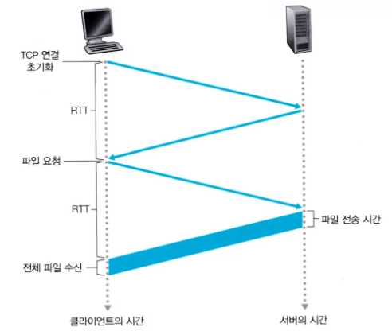

# Connection과 Connectionless
Stateful과 Stateless는 서버가 클라이언트의 상태를 유지하는가 유지하지 않는가에 관련이 있었다. 즉, 해당 개념은 서버의 장애 대응과 확장성과 연관이 있었다. 


반면, Connection과 Connection Less는 확장성보다는 서버와 클라이언트 사이의 Connection이 계속 유지되는 가와 유지되지 않는 가로 나뉜다. 이 개념은 클라이언트와 서버 사이의 HTTP 연결과 관련 되어 있다.


HTTP3.0을 제외하고는 HTTP는 전송 계층 프로토콜로 TCP를 주 프로토콜로 사용하는데, TCP는 커넥션을 맺고 끊는 3-way handshake와 4-way handshake가 반복된다. 


이 때, 요청을 보낼 때마다 해당 커넥션을 맺는 과정이 반복된다면, 매 요청마다 커넥션을 맺고 요청하는데 2 * RTT 만큼의 손해를 보게 된다. RTT(round-trip time)은 두 지점 사이의 모든 전파 지연, 패킷 지연 등의 모든 것을 감수하여 두 종단점 사이의 패킷이 도착하는 데 걸리는 시간 쯤으로 보면 된다. 이는 서버가 해외에 있고 두 지점 사이의 거리가 멀고 글로벌 서비스를 제공하는 회사일수록 부담이 된다.

따라서, 두 지점 사이의 Connection 정보를 특정 시간 동안 유지하고 일정 시간 이상 서로 통신을 하지 않는다면, 그 Connection을 끊어버리는 방식인 Connection Less를 사용하여 위의 문제를 해결하려고 한다. 그러면, TCP 연결 초기화로 인한 두 지점 사이의 요청마다의 불필요한 통신 횟수가 줄어들게 될 것이고, 응답 속도 개선으로 이어지게 될 것이다.

## 비지속 연결과 지속 연결
컴퓨터 네트워크 하향식 접근에서는 다음과 같이 분류를 한다. 


클라이언트와 서버 사이의 상호작용에서 TCP 상 요구/응답이 분리된 TCP 연결로 보내져야 하는가?(비지속 연결, non-persistent connection)과 같은 TCP 연결 사응로 보내지는가?(지속 연결, persistent connection)으로 나뉜다.


HTTP 1.0은 비지속 연결을 지원한다. 서버가 객체를 보내면 TCP 연결을 끊고 보내기를 반복한다. 이 때마다 다음과 같은 과정이 일어나며 클라이언트는 특정한 파일 하나를 받기 위해서 2RTT와 HTML 파일을 전송받는데 걸리는 시간만큼을 더한 시간을 응답시간으로 요구 받는다.





비지속 연결에는 다음과 같은 단점들이 있다.

- 각 요청 객체에 대한 새로운 연결이 설정되고 유지돼야 한다. (이는 TCP 버퍼를 할당되고 TCP 변수들이 클라이언트, 서버 양쪽에 유지되어야 함을 의미한다.)
- 각 객체마다 2RTT(연결 설정 1RTT, 객체 요청 1RTT)씩 손해를 본다.


HTTP 1.1에서는 지속 연결을 지원한다. 여기선 서버가 응답을 보내고 TCP 연결을 그대로 유지한다. 기본 파일과 여러 이미지를 하나의 지속 TCP 연결을 통해서 보낼 수 있다. 또한, 요구에 대해서 응답에 대한 걸 기다리지 않고 연속해서 파이프라이닝으로 받아낼 수 있다. 일반적으로 HTTP 서버는 일정 기간 사용되지 않으면 연결을 닫는다.


## HTTP Keep-Alive와 TCP keep-Alive
HTTP 프로토콜에서는 앞에서 언급한 지속 연결과 비지속 연결 부분을 표현하기 위해서 keep-alive라는 헤더를 사용한다. 각각이 설정된 것과 되지 않은 것의 동작은 아래와 같이 움직인다.


위에서 언급한 개념에 따르면 KeepAlive Off는 비지속 연결로, KeepAlive On은 지속 연결로 연결이 되며 HTTP 1.0에서는 keep-alive를 명시해줘야 하지만, HTTP 1.1에서는 default 값으로 keep-alive를 지원한다.


예시를 들면 아래와 같은 응답이 있을 수 있다. 아래의 서버 응답은 Keep-alive를 통해 지속 연결로 설정을 하되, 500번의 응답까지, 10초 동안 유지한다는 것을 의미한다.


```http
HTTP/1.1 200 OK
Connection: Keep-Alive
Keep-Alive: timeout=10, max=500
```

- max값을 높일 때는 한 번에 전송해야 하는 짜잘한 파일의 양이 많아질 때, 값을 높이면 좋다.
- timeout 값을 높일 때는 자주 방문하고 traffic volume이 큰 경우에 TCP 연결 수를 제한함으로써 유용하게 사용할 수 있다.

만약에 사용하지 않거나 못한다면 다음과 같이 응답이 올 것이다.

```http
HTTP/1.1 200 OK
Connection: Close 
```

위와 같은 keep-alive를 통해 사이트에서 기대하는 바를 다시 정리해보면 아래와 같다.


- 네트워크 리소스에 대한 절약
- 네트워크 혼잡도를 낮춤
- 지연 시간을 감소시킴. 특히 암호화가 필요한 SSL/TLS의 경우엔 이 의미 더 큼.


추가적으로, TCP에서도 Keep-alive라는 개념이 있다. TCP의 Keep-alive는 HTTP 프로토콜과 관련이 있다기 보다는 OS차원에서 어떻게 TCP를 관리할 지와 관련이 있다. 설정은 아래와 같이 OS단에서 해야 한다.

```ini
tcp_keepalive_time = 7200(초)
tcp_keepalive_intvl = 75(초)
tcp_keepalive_probes = 9 (프로브 수)
```


각각의 의미를 설명하면, 7200초(2시간) 동안 커넥션을 유지한다. 그런데, 2시간 동안 TCP 연결에서 데이터 교환이 없다면 75초에 한 번씩 keep-alive 패킷을 보내 연결이 활성화 상태인지 확인하고 이 과정을 9번까지만 하겠다는 의미이다.


서비스마다 이 설정 값을 다르게 해야하며 특정한 CDN 제공자는 900초 동안 커넥션을 유지하고 60초에 한 번씩 5번만 확인해보는 게 좋다고는 하는데, 이 부분은 조금 더 찾아보거나 필요할 때 확인해보는 게 좋을 것 같다.


***


references.
- 모든 개발자를 위한 HTTP 웹 기본 지식, 김영한 강의
- 컴퓨터 네트워크 하향식 접근, 제 8판
- [http_keep_alive_and_tcp_keep_alive](https://stackoverflow.com/questions/9334401/http-keep-alive-and-tcp-keep-alive)
- [http_keep_alive](https://www.imperva.com/learn/performance/http-keep-alive/)
- [http_keep_alive_vs_tcp_keep_alive_codes](https://sabarada.tistory.com/262)
- [tcp_keep_alive_settings](https://webhostinggeeks.com/howto/tcp-keepalive-recommended-settings-and-best-practices/)