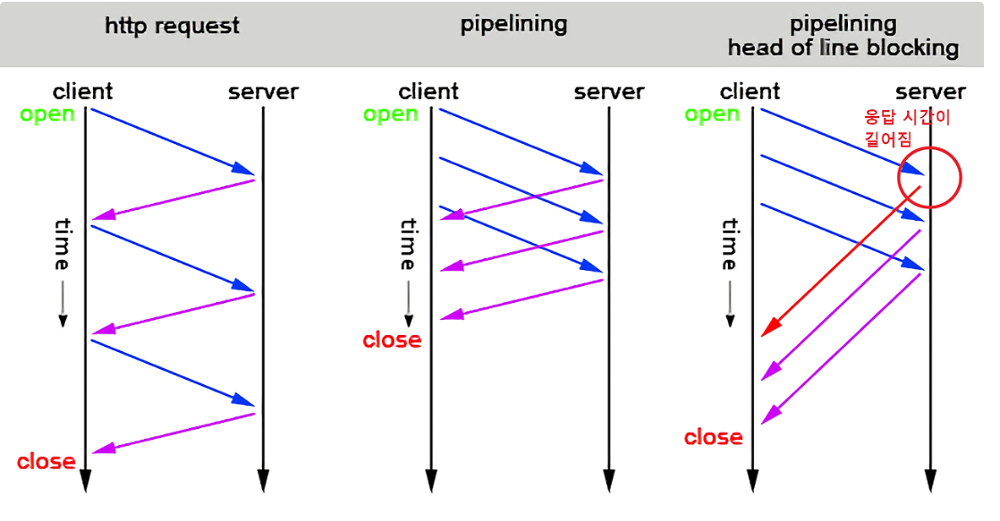
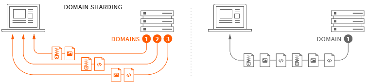
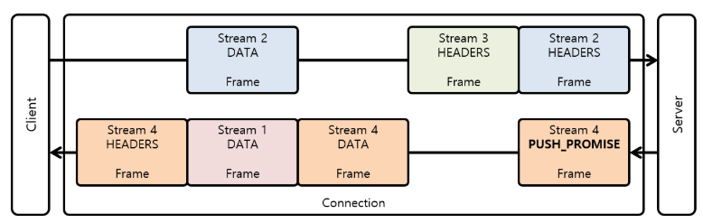

### HOL Blocking에 관해서
HOL Blocking(Head-of-line Blocking)은 패킷 큐가 첫 번째 패킷에 의해 보류될 때 발생하는 성능 제한 현상을 말한다.
순서 없는 전달 혹은 HTTP 파이프라이닝의 여러 요청에서 발생을 한다.

특히, HTTP 프로토콜에서 순차적으로 파일을 보내는 과정에서 초반에 굉장히 큰 전송이 있고 이후의 전송이 작고 많은 경우에 발생한다.

### HTTP 1.1에서의 HOL Blocking

#### ※ Pipelining
파이프 라이닝은 여러 개의 요청을 보낼 때, 처음 응답을 기다리지 않고 요청을 한꺼번에 보내는 것을 의미한다.
이 과정에서 HOL Blocking이 일어나는 원인은 응답순서를 지키기 위해서인데, 응답 순서를 지키기 위해 이후의 처리를 미루는 작업이 일어난다.
특히 이 현상은 초기 요청에서 큰 리소스를 전달하는 경우 더 심각한 문제로 이어진다.
위의 그림에서는 실질적으로 응답을 기다리지 않고 처리할 수 있는 것처럼 나왔지만 실제로는 아래의 그림처럼 중간 큰 게 오면 해당 요청 처리가 끝날 때까지 뒤로 밀린다.

그렇기 때문에 현재 살아남은 대부분의 브라우저에서는 파이프라이닝 긴으을 지원하지 않는다.

#### ※ 병렬 처리 방식(Domain Sharding)
그럼, 병렬적으로 TCP 커넥션을 여러 개 맺어서 각각의 커넥션에서 파일과 같은 리소스를 한꺼번에 보내줄 수 있지 않을까 생각할 수 있다.
그런 방법도 있다. 하지만 브라우저에서는 도메인 당 최대 동시 연결 개수가 정해져있고, 도메인 주소를 찾는 등의 오버헤드가 있기 때문에 개선이 필요한 방식이었다.

참고로 위에서 언급한 HOL Blocking은 Application 계층 Transport 계층 둘 다에서 일어날 수 있는 문제이다.

### HTTP 2.0에서의 HOL Blocking
이전의 Pipelining이나 Domain Sharding 방식과 다른 MultiPlexing 방식이 HTTP 2.0에서 도입되기 시작했다.
HTTP 2.0을 사용하면 동일한 연결에서 여러 요청을 보낼 수 있다. Pipelining과 비슷해보이지만 응답을 기다리면서 순차적인 처리를 하는 것이 아닌
거의 병렬적인 처리를 할 수 있게 함으로써 앞의 큰 요청을 처리하느라 후속 처리가 Blocking 되었던 Pipelining에 비해 개선이 된 방식이다.

Pipelining이랑 비슷하지만 더 많은 요청을 한꺼번에 보내고 순서 제어를 덜해서 뒤의 요청을 막지 않는다는 특징을 가졌다고 보는 게 맞는 것 같다.
하지만, HTTP2.0까지는 TCP 프로토콜을 사용하기 때문에 TCP 프로토콜의 순서 제어에 대해서는 영향을 받는다.

위에서 언급한 순서를 따지지 않는다는 건 Application 계층의 문제지 Transport 계층의 문제가 아니다.
따라서, Transport 계층에서 네트워크 지연이나 패킷 손실 등의 문제가 발생하면 동일하게 HOL Blocking 문제는 동일하게 일어난다.

※ 추가정보
 HTTP 2.0에서는 TEXT 형식이 아니라 Binary frame을 단위로 전송이 되며 이런 frame이 모여서 Message가 된다. 
이 메시지가 TCP 커넥션 하나로 연결된 Stream에서 응답 순서에 관계 없이 전송이 되는 것이다.

#### 참고 자료
- https://freecontent.manning.com/animation-http-1-1-vs-http-2-vs-http-2-with-push/?source=post_page-----565a7b184c--------------------------------
- https://stackoverflow.com/questions/36517829/what-does-multiplexing-mean-in-http-2/36519379#36519379
- https://en.wikipedia.org/wiki/Head-of-line_blocking
- https://inpa.tistory.com/entry/WEB-%F0%9F%8C%90-HTTP-20-%ED%86%B5%EC%8B%A0-%EA%B8%B0%EC%88%A0-%EC%9D%B4%EC%A0%9C%EB%8A%94-%ED%99%95%EC%8B%A4%ED%9E%88-%EC%9D%B4%ED%95%B4%ED%95%98%EC%9E%90