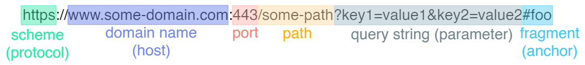

## 1. Origin



Origin(출처)은 웹 브라우저에서 보안 정책을 적용할 때 사용하는 개념이다. 두 URL이 같은 출처로 취급되기 위해서는 프로토콜, 호스트, 포트 번호가 모두 동일해야 한다

- **프로토콜**: http, https 등 사용하는 프로토콜
- **호스트**: 도메인 이름 또는 IP 주소
- **포트 번호**: URL에 포트 번호가 명시되지 않은 경우 기본 포트를 기준으로 함 (http는 80, https는 443)

## 2. SOP (Same-Origin Policy)

동일 출처 정책은 하나의 출처에서 가져온 문서나 스크립트가 다른 출처의 자원에 함부로 접근하지 못하도록 제한하는 보안 정책이다. 만약 이러한 정책이 없다면 악의적인 사용자가 CSRF 혹은 XSS 등을 통해 다른 사용자의 민감한 정보를 손쉽게 탈취할 수 있다.

SOP 정책에서 서로 다른 출처 간에 허용되는 요청 및 리소스는 다음과 같다.

### **2-1. 교차 출처 쓰기(Cross-Origin Write)**

다른 출처로 데이터를 전송하는 작업을 의미하며 대체로 허용된다. 하지만 일부 HTTP 요청은 Preflight 요청을 필요로 할 수 있다.

- **하이퍼링크 클릭**: 사용자가 다른 사이트로 이동하도록 링크를 클릭할 수 있다.
- **리다이렉트**: 서버 또는 클라이언트 측에서 URL을 통해 다른 출처로 이동할 수 있다.
- **HTML 폼 제출**: 데이터를 포함한 폼을 다른 출처로 제출할 수 있다.

### **2-2. 교차 출처 삽입(Cross-Origin Embedding)**

다른 출처의 리소스를 브라우저에 삽입하거나 표시하는 작업을 의미하며 대체로 허용된다.

- **JavaScript**: `<script src="…">`를 통해 외부 JavaScript를 로드할 수 있다. 단, 구문 오류에 대한 세부 정보는 동일 출처의 스크립트에서만 확인 가능하다.
- **CSS**: `<link rel="stylesheet" href="…">`를 통해 외부 CSS를 로드할 수 있다. 단, 올바른 MIME 유형과 유효한 CSS 구문을 포함해야 한다.
- **이미지**: `` 태그로 외부 이미지를 삽입할 수 있다. 픽셀 데이터는 읽을 수 없지만, 메타 데이터는 브라우저를 통해 확인 가능하다.
- **미디어**: `<video>` 및 `<audio>` 태그로 외부 미디어를 재생할 수 있다.
- **리소스**: `<object>` 및 `<embed>`를 통해 외부 리소스를 삽입할 수 있다.
- **글꼴**: `@font-face`로 외부 글꼴을 사용할 수 있다. 단, 일부 브라우저에서는 동일 출처 정책을 요구할 수 있다.
- **외부 콘텐츠**: `<iframe>` 태그로 외부 콘텐츠를 삽입할 수 있다. 단, X-Frame-Options 헤더로 프레임 삽입을 제한할 수 있다

### **2-3. 교차 출처 읽기(Cross-Origin Read)**

다른 출처의 데이터나 내용을 직접 읽는 작업을 의미하며 대체로 허용되지 않는다. 단, 직접적으로는 읽지 못해도 교차 출처 삽입으로 인해 간접적으로 일부 정보가 노출될 수 있다. 예를 들어 `` 태그로 이미지를 삽입한 경우, 이미지의 픽셀 데이터를 직접 읽을 수는 없지만 이미지의 너비와 높이 같은 메타 데이터는 브라우저를 통해 노출된다. 이를 통해 악의적인 사용자가 시스템에 대한 공격 경로를 계획하거나, 민감한 정보를 유추할 수 있다. 

## 3. CORS 정책

SOP 정책으로 인해 필요한 자원까지 로딩하지 못하는 상황이 생길 수 있다. 이러한 경우에 사용하는 것이 CORS, 교차 출처 리소스 공유이다. 이는 브라우저가 자신의 출처가 아닌 다른 출처로부터 자원을 로딩할 수 있도록 허가하는 보안 정책이다. CORS 정책은 여러 헤더들을 통해 제어할 수 있다.


CORS는 브라우저의 정책이기 때문에 다른 출처의 리소스 사용을 제한하는 것은 서버가 아니라 브라우저이다. 따라서 서버는 CORS 정책을 위반한 요청이라도 정상적으로 처리하여 응답하지만, 응답을 받은 브라우저에서 이를 분석하여 CORS 정책을 위반한 경우 차단한다.

### 3-1. 요청 관련 헤더

1. **Origin**
    
    요청이 어디서 시작되었는지를 나타내며, Cross-Origin 요청에서 항상 전송된다.
    
    - `Origin: https://example.com`
2. **Access-Control-Request-Method**
    
    Preflight 요청에서 실제 요청에 사용할 HTTP 메서드를 서버에 알려주는 헤더이다.
    
    - `Access-Control-Request-Method: POST`
3. **Access-Control-Request-Headers**
    
    Preflight 요청에서 실제 요청에 사용할 헤더를 서버에 알려주는 헤더이다.
    
    - `Access-Control-Request-Headers: Content-Type, X-PINGOTHER`

### 3-2. 응답 관련 헤더

1. **Access-Control-Allow-Origin**
    
    리소스를 요청하는 출처를 정의한다. 특정 출처를 지정하거나 `*`을 사용해 모든 출처를 허용할 수 있다. `*`은 자격 증명 없이 요청하는 경우에만 허용된다. 서버가 특정 출처만 허용하는 경우, `Vary: Origin` 헤더를 추가하여 요청의 출처에 따라 응답이 달라질 수 있음을 클라이언트에 알린다.
    
    - `Access-Control-Allow-Origin: https://mozilla.org`
    - `Access-Control-Allow-Origin: *`
2. **Access-Control-Expose-Headers**
    
    클라이언트 측 JavaScript에서 접근할 수 있도록 허용된 응답 헤더를 나열한다.
    
    - `Access-Control-Expose-Headers: X-My-Custom-Header, X-Another-Custom-Header`
3. **Access-Control-Max-Age**
    
    Preflight 요청의 결과를 얼마나 오래 캐시할 수 있는지 시간을 나타낸다.
    
    - `Access-Control-Max-Age: 86400` (24시간 동안 캐시)
4. **Access-Control-Allow-Credentials**
    
    요청에 자격 증명이 포함될 수 있는지 여부를 나타낸다. 자격 증명은 쿠키, 인증 헤더 등이 포함된 요청이다. 이 헤더가 `true`로 설정되면 자격 증명 요청이 허용된다.
    
    - `Access-Control-Allow-Credentials: true`
5. **Access-Control-Allow-Methods**
    
    리소스에 접근할 때 허용되는 HTTP 메서드를 지정한다. Preflight 요청에 대한 응답으로 사용된다.
    
    - `Access-Control-Allow-Methods: GET, POST, OPTIONS`
6. **Access-Control-Allow-Headers**
    
    Preflight 요청에 대한 응답으로, 실제 요청에서 사용할 수 있는 HTTP 헤더를 지정한다.
    
    - `Access-Control-Allow-Headers: Content-Type, X-PINGOTHER`

### 3-3. 동작 흐름

CORS의 동작 흐름은 간단한 요청, 복잡한 요청, 그리고 Credential을 포함한 요청 세 가지 경우로 나눌 수 있다.

1. **간단한 요청**
    - HTTP 메서드가 아래 중 하나에 해당
        - `GET`
        - `HEAD`
        - `POST`
    - 요청 헤더가 아래 목록만 포함
        - `Accept`
        - `Accept-Language`
        - `Content-Language`
        - `Content-Type`의 경우 아래 목록만 포함
            - `application/x-www-form-urlencoded`
            - `multipart/form-data`
            - `text/plain`
    
    위 조건을 만족할 경우 Preflight 요청 없이 다른 출처에 HTTP 요청을 보낼 수 있다. 그리고 응답을 받은 후 브라우저가 응답 헤더를 확인하여 요청이 CORS 규칙을 만족했는지 검증한다.
    
2. **복잡한 요청**
    
    아래에서 설명할 Preflight 요청을 먼저 전송한 뒤 실제 요청을 처리한다.
    
3. **Credential을 포함한 요청**
    
    Credential은 쿠키, HTTP 인증 헤더, 또는 `Authorization` 헤더와 같은 민감한 인증 정보를 의미한다. 다른 출처에 Credential을 포함한 요청을 주고받으려면 클라이언트와 서버에서 아래 조건을 충족해야 한다.
    
    - 클라이언트
        
        모든 출처에 쿠키와 인증 정보를 포함하도록 요청에 다음과 같은 설정을 추가한다.
        
        - `credentials: "include"`
    - 서버
        
        응답 헤더를 다음과 같이 설정한다.
        
        - `Access-Control-Allow-Credentials: true`
        - `Access-Control-Allow-Origin`: `*`은 사용할 수 없으며 반드시 특정 출처를 명시해야 함
        
### 3-4. **Preflight 요청**

브라우저가 실제 요청이 안전하게 전송될 수 있는지 서버에 묻기 위해 보내는 HTTP OPTIONS 요청이다. 이는 사용자의 데이터를 보호하고, 서버가 다른 출처의 요청을 안전하게 처리할 수 있는지 확인하는 과정이다. Preflight 요청 흐름은 다음과 같다.


1. **브라우저에서 Preflight 요청 전송**
    
    브라우저는 실제 요청의 메서드와 헤더를 확인하고, 이들이 안전한지 확인하기 위해 서버에 OPTIONS 메소드로 요청을 보낸다.
    
    ```java
    OPTIONS /doc HTTP/1.1
    Host: bar.other
    Origin: https://foo.example
    Access-Control-Request-Method: POST
    Access-Control-Request-Headers: content-type,x-pingother
    ```
    
2. **서버에서 응답 전송**
    
    서버는 OPTIONS 요청에 대해 허용할 수 있는 메서드와 헤더를 명시한 응답을 보낸다.
    
    ```java
    HTTP/1.1 204 No Content
    Access-Control-Allow-Origin: https://foo.example
    Access-Control-Allow-Methods: POST, GET, OPTIONS
    Access-Control-Allow-Headers: X-PINGOTHER, Content-Type
    Access-Control-Max-Age: 86400
    ```
    
3. **실제 요청**
    
    Preflight 응답이 돌아오면 브라우저에서 CORS 정책에 맞는지 검토한 뒤 실제 요청을 서버로 보낸다.
    
    ```java
    POST /doc HTTP/1.1
    Host: bar.other
    Origin: [https://foo.example](https://foo.example/)
    X-PINGOTHER: pingpong
    Content-Type: text/xml
    ```
    

### 3-5. 백엔드에서 CORS 정책 처리

1. **WebMvcConfigurer 사용**
    
    `WebMvcConfigurer`를 구현하여 `addCorsMappings` 메서드를 오버라이드하면 애플리케이션의 모든 엔드포인트에 대해 공통된 CORS 정책을 적용할 수 있다.
    
    ```java
    import org.springframework.context.annotation.Configuration;
    import org.springframework.web.servlet.config.annotation.CorsRegistry;
    import org.springframework.web.servlet.config.annotation.WebMvcConfigurer;
    
    @Configuration
    public class GlobalCorsConfig implements WebMvcConfigurer {
    
        @Override
        public void addCorsMappings(CorsRegistry registry) {
            // 모든 엔드포인트에 대해 CORS 설정
            registry.addMapping("/**")  // 모든 요청 경로에 대해 CORS 허용
                    .allowedOrigins("https://example.com")  // 허용할 출처
                    .allowedMethods("GET", "POST", "PUT", "DELETE")  // 허용할 HTTP 메서드
                    .allowedHeaders("Content-Type", "Authorization")  // 허용할 헤더
                    .allowCredentials(true)  // 자격 증명(쿠키 등)을 포함한 요청 허용
                    .maxAge(3600);  // Preflight 요청 결과 캐시 시간 (1시간)
        }
    }
    ```
    
2. **`@CrossOrigin` 애노테이션 사용**
    
    Spring에서는 `@CrossOrigin` 애노테이션을 사용하여 특정 엔드포인트에 CORS를 적용할 수 있다. 이를 통해 전역 설정을 오버라이드하고, 개별적으로 세부적인 설정을 할 수 있다.
    
    ```java
    import org.springframework.web.bind.annotation.CrossOrigin;
    import org.springframework.web.bind.annotation.GetMapping;
    import org.springframework.web.bind.annotation.RestController;
    
    @RestController
    public class MyController {
    
        // 특정 엔드포인트에만 CORS 설정
        @CrossOrigin(origins = "https://example.com", // 허용할 출처
    							    allowedHeaders = "Content-Type, X-Custom-Header") // 허용할 헤더
        @GetMapping("/my-endpoint")
        public String getData() {
            return "CORS 설정이 적용된 응답";
        }
        
        // 기본 CORS 정책 적용 (모든 출처 허용, 그 외는 전역 CORS 설정 따름)
        @CrossOrigin
        @GetMapping("/public-endpoint")
        public String getPublicData() {
            return "공용 엔드포인트 응답";
        }
    }
    ```
    
3. **`CorsFilter` 사용**
    
    Spring에서는 `CorsFilter`를 사용하여 CORS 설정을 필터 방식으로 처리할 수 있다. 이는 Spring Security와 같은 다른 설정과 통합할 때 유용하다.
    
    ```java
    import org.springframework.context.annotation.Bean;
    import org.springframework.context.annotation.Configuration;
    import org.springframework.web.filter.CorsFilter;
    import org.springframework.web.cors.CorsConfiguration;
    import org.springframework.web.cors.UrlBasedCorsConfigurationSource;
    
    @Configuration
    public class CorsConfig {
    
        @Bean
        public CorsFilter corsFilter() {
            UrlBasedCorsConfigurationSource source = new UrlBasedCorsConfigurationSource();
    
            CorsConfiguration config = new CorsConfiguration();
            config.setAllowCredentials(true);  // 자격 증명 허용
            config.addAllowedOrigin("https://example.com");  // 허용할 출처
            config.addAllowedMethod("GET");  // 허용할 HTTP 메서드
            config.addAllowedMethod("POST");
            config.addAllowedHeader("Content-Type");  // 허용할 헤더
            config.setMaxAge(3600L);  // Preflight 요청 결과 캐시 시간 설정
    
            source.registerCorsConfiguration("/**", config);  // 모든 경로에 대해 CORS 설정
    
            return new CorsFilter(source);
        }
    }
    ```
    
---

references.
- [sop](https://developer.mozilla.org/ko/docs/Web/Security/Same-origin_policy)
- [http_cors](https://developer.mozilla.org/en-US/docs/Web/HTTP/CORS)
- [cors_simple_request](https://evan-moon.github.io/2020/05/21/about-cors/#simple-request)
- [sop_and_cors](https://jaehyeon48.github.io/web/sop-and-cors/)