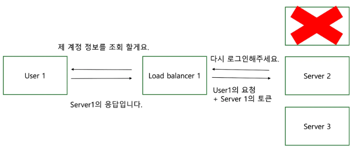

# Stateful과 Stateless
서버 내에 상태를 유지하는 것과 유지하지 않는 것을 각각 Stateful, Stateless라고 한다.

## Stateful
Stateful은 서버에서 클라이언트의 상태 정보를 유지하고 있는 것이다. stateful의 대표적인 예시는 로그인 여부와 관련된 것이 있다. 사용자가 로그인을 하면 해당 사용자의 로그인 여부를 서버에 저장을 한다. 또한, 브라우저 내의 쿠키를 활용하여 해당 로그인 여부와 비교해서 사용을 한다. 그 과정은 아래와 같다.

#### User1과 Server1 간의 관계 정보를 Server1에만 저장

#### Server1이 장애가 나서, load balancer는 Server2로 요청을 보냄. 하지만, Server1에 로그인 정보가 기록되어있으므로 다시 로그인하라 요청함

하지만, Stateful의 단점은 특정한 서버에서 클라이언트의 상태를 보존하고 있다는 것이 문제이며 그 단점을 정리해보면 아래와 같다.

- 좋지 않은 사용자 경험: 특정 서버가 멈추어 다른 서버로 넘어갔을 땐, 기존에 서버에 저장된 내용이 날아가기 때문에 사용자는 해당 과정을 다시 경험해야 한다.

- 확장성: 특정 서버에 대한 로드밸런싱 과정을 거쳐야 하며 장애가 났을 때를 대비한 복잡한 알고리즘 과정을 걸쳐야 한다. 그렇기에 확장을 하는 과정이 어렵다.

- 자원 활용성: 서버 내에 정보를 저장하지 않으므로 더 많은 사용자를 받을 수 있다.
이런 문제를 해결하기 위해 현업에서는 실제로는 global cache의 역할로 redis와 같은 InMemoryDB에 해당 내용을 저장한다. 하지만 이 과정은 replication이나 clustering 등의 장애를 대응하기 위한 추가적인 정보를 알아야 한다는 문제가 있다.

하지만, 이렇게 로그인과 같이 정보 유지를 해야 하는 부분에 대해서 어떻게 단일 지점 장애를 복구할 수 있을 지 추가적인 고민이 필요하다.

따라서, Stateful의 위에서 언급한 문제점들을 Stateless의 구조로 변경을 하면 해당 문제를 해결할 수 있다. Stateless하게 설계를 한다면 위의 과정이 아래처럼 바뀔 것이다.

## Stateless
Stateful의 위에서 언급한 문제점들을 Stateless의 구조로 변경을 하면 해당 문제를 해결할 수 있다. Stateless하게 설계를 한다면 위의 과정이 아래처럼 바뀔 것이다.

다음과 같이 Server 1이 장애가 났음에도 서버는 상태를 유지하지 않고 User 측에서 이전에 있던 정보를 한꺼번에 보내니, Server2에서는 User1의 이전 처리를 몰라도 계속 유지해서 처리를 해줄 수 있다.

이런 특징 때문에 Stateless 구조에서는 확장성이 뛰어나 서버를 확장시키는 것에 큰 문제가 없다. 하지만, 이전 정보와 함께 더 많은 양의 데이터를 서버로 보내야 한다는 문제가 있고, 위에서 언급한 로그인 같이 서버에서 꼭 정보를 유지해야만 하는 것들도 있어. Stateless 설계로의 설계가 불가능한 경우가 꽤나 있다.

### ※ Stateful 관련 보충 설명
위의 Stateful예시에서는 어느정도 Stateful한 것과 Stateless한 걸 섞어서 설명하고 있다. Stateful한 부분에 있어서는 서버 내에 세션 로그인 정보를 유지한다는 점이 있다. 

반면, Stateless한 부분은 토큰을 외부로 주어서 세션 ID와 관련된 정보를 클라이언트 측에서도 보유하게 하는 모델로 설명을 했다. 이는 이후에 HTTP 프로토콜로 요청 때 토큰을 함께 보냄으로써 상대방에게 내가 누구인지에 관해 알려주는 것인데 이런 부분은 stateless하다고 할 수 있을 것 같다.

***

references.
- [stateful_vs_stateless_comparison1](https://www.redhat.com/en/topics/cloud-native-apps/stateful-vs-stateless)
- [statful_and_stateless_comparison2](https://inpa.tistory.com/entry/WEB-%F0%9F%93%9A-Stateful-Stateless-%EC%A0%95%EB%A6%AC)

