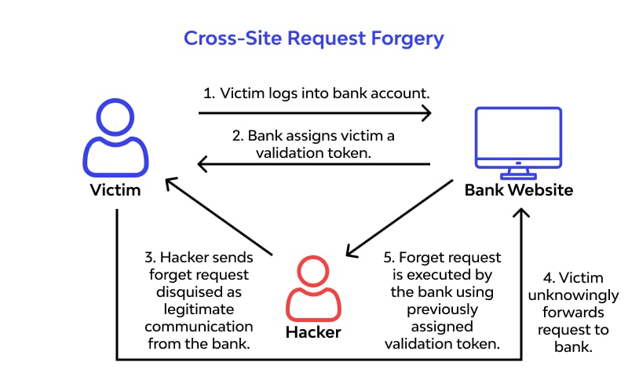
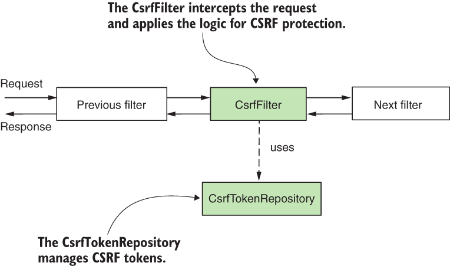

# CSRF (Cross-Site Request Forgery)
`CSRF` 는 공격자가 피해자(사용자)가 자신의 의도와 무관한 요청을 특정 웹 서버로 보내도록 속이는 공격이다. 즉, 사용자의 인증 정보를 악용하여 공격자가 원하는 작업(ex. 계좌 이체, 개인정보 변경 등)을 실행하도록 만든다.

CSRF는 주로 사용자가 로그인한 상태에서 발생하고, 서버가 요청의 출처를 제대로 확인하지 않고 사용자의 인증 정보(세션, 토큰 등)를 신뢰하는 경우 발생한다.

#### 정리
- 사용자는 자신이 공격에 가담했음을 인지하지 못함
- 공격자가 직접 인증을 하지 않고 피해자의 인증 정보를 악용
- 주로 상태 변화를 일으키는 공격 요청이 들어온다 (데이터 수정, 삭제, 전송 등)

#### CSRF 동작 예시
1. 사용자가 신뢰할 수 있는 웹사이트(ex. 은행 사이트)에 로그인하여 인증 정보 설정됨
2. 공격자는 악성 스크립트나 URL이 포함된 피싱 이메일 또는 웹사이트를 통해 사용자를 유도
3. 사용자가 악성 URL을 클릭하면, 해당 요청이 사용자의 인증 정보를 포함하여 웹 애플리케이션으로 전송됨
4. 서버는 요청의 출처를 확인하지 않으므로 이를 정상적인 요청으로 처리




## CSRF에 대한 Front와 Back의 대처 방법
### Back
#### (1) SameSite 쿠키 설정
- **SameSite** 속성은 쿠키가 동일한 사이트에서만 전송되도록 제한하여 CSRF 공격을 방어한다.
- 크로스 사이트로 전송하는 요청일 때, 쿠키 전송에 제한을 두는 것이 목적이다.

```http
Set-Cookie: sessionId=abc123; Secure; HttpOnly; SameSite=Strict;
```
아래와 같은 3가지 타입이 있다.
 - **Strict**: 크로스 사이트 요청에는 쿠키가 전송되지 않음
 - **Lax**: 사용자 입력을 유발하는 크로스 사이트 요청(GET, POST 등)에만 쿠키를 제한적으로 전송
 - **None**: 모든 요청에 쿠키를 전송
 

#### (2) CSRF 토큰 사용
- CSRF 토큰: 서버에 들어온 요청이 실제 서버에서 허용한 요청이 맞는지 확인하기 위한 토큰
- 클라이언트가 요청 시 해당 토큰을 포함하여 전송하면, 서버는 이를 검증하여 요청의 정당성을 확인한다.
- 요청을 보낸 사용자가 악성 공격자가 아닌지 판단하는 목적으로 사용된다.


#### + Spring Security와 CSRF 토큰
- 로그인 과정에 Spring Security를 추가했을 때, CSRF 토큰에 대한 이해가 없으면 `403 Forbidden` 오류를 보게된다.
- Spring Security 는 필터 기반으로 동작하여, Dispatcher Servelet이 클라이언트 요청을 받기 전에 기본적으로 제공되는 10개 이상의 시큐리티 필터를 거친다.




CSRF 공격을 방지하기 위해 CSRF 토큰을 가진 요청만 처리하도록 방어한다. 
  - 서버에 중요한 영향을 끼칠 수 있는 POST 방식(HTML form, AJAX)에 대해 CSRF 토큰 체크 
  - GET 방식은 기본적으로 토큰을 체크하지 않음
- Spring Security의 CSRF 설정은 기본값으로 enable 이고, 서버가 자동으로 CSRF 토큰을 생성해서 클라이언트에 전달한다.
  - 전달 방식 1: **HTML form** (SSR 사용하는 JSP나 Thymeleaf 를 사용하는 경우 해당 방식 이용)
  - 전달 방식 2: **HTTP 응답 헤더** (REST API를 사용하는 대부분의 애플리케이션)
 - 해당 전달 방식이 제대로 설정되었다면, `403 Forbidden` 문제는 클라이언트에서 CSRF 토큰을 포함하지 않고 요청을 보냈을 확률이 높다. 


#### (3) 중요한 상태 변경 요청을 POST, PUT, DELETE 로 제한하기
- GET 방식으로 API를 호출하면, URL 뒤에 폼 데이터가 붙어서 전달되기 때문에 CSRF 공격에 쉽게 노출될 수 있다.
- POST 요청은 데이터를 요청 본문에 담아서 전달하기 때문에 URL에 노출되지 않는다.
- 또한, Spring Security의 CSRF 토큰 검증 수행이 기본적으로 POST, PUT, DELETE에 대해 진행되므로 안전을 위해 해당 메서드 요청으로 제한할 수 있다. (PATCH는 검증 X)


#### (4) Referer 검증
- 수신 요청의 유효성을 검증할 때, 요청의 referer 헤더와 일치하는 allowed-referers 항목을 찾고, allowed 항목에 존재하는 경우 요청 성공, 없는 경우 요청에 실패한다.


### Front
- CSRF의 공격 목적지가 서버인만큼, 클라이언트는 주로 서버가 제공하는 CSRF 방어 메커니즘을 잘 활용하는 정도의 책임이 있다.
- CSRF 토큰을 서버 설정 방식에 맞게 요청에 포함 시키기 (서버가 이 토큰을 검증하여 요청의 안전함을 판단할 수 있도록)
  - SSR 환경에서, CSRF 토큰을 폼 필드에 넣어서 전달
  - 일반적인 REST API 환경에서, HTTP 응답 헤더를 통해 CSRF 토큰 전달
- 서버가 Samesite 쿠키 설정을 해놓았다면, 설정에 맞게 쿠키 정책 준수
- 클라이언트에서 외부 API 요청이 필요한 경우, 서버의 CORS 설정을 확인하고 동작하도록 처리


---
## Samesite 쿠키 설정
Samesite 쿠키는 이전에 언급했듯이, 서드 파티 쿠키의 보안적 문제를 해결하기 위해 만들어졌고, 설정에 크게 세 가지 옵션이 있었다.
 - Strict
 - Lax
 - None

여기서 `None` 옵션이 필요한 이유는 CrossSite(서로 다른 도메인)간 쿠키 이동이 필요한 경우에 `None` 으로 설정하여 이동이 가능하게 만들기 위함이다. 그러나 위에 언급된 CSRF 공격 위험을 방지하고자 `Secure` 옵션도 같이 설정하여 HTTPS 에서 SSL/TLS 인증과 암호화를 필수로 하고 있다.


현재까지는 위 방법이 주요하게 사용되었으나 앞으로 Samesite 쿠키 설정에 대해 중요하게 봐야하는 점이 있는데, 바로 크롬 브라우저의 움직임이다.


크롬에서는 장기적으로 서드 파티 쿠키에 대한 지원을 단계적으로 제거할 예정으로, 크롬 브라우저의 default 쿠키 옵션을 `lax` 로 올렸다. 또한, 미래에는 모든 쿠키가 `SameSite=Strict`으로 설정된 것처럼 동작하게 될 것이라고 발표했다.
이후, 2024년 1월 부터 구글에서 서드 파티 쿠키 지원 중단 정책을 시행했고, 중단 범위를 계속 확대하고 있다.


그러나 서드 파티 쿠키가 바로 중단되기는 어려운 상황이다. 현재 많은 서비스들이 여러 개의 도메인을 사용하여 운영되고 있기 때문이다. 구글은 이 문제를 해결하기 위해서 **First-Party Sets(Related Website Sets)** 라는 표준을 제안했다.

이는 여러 도메인을 동일한 사이트로 다룰 수 있도록 만드는 기술인데, 실제로 운영에 여러 도메인을 사용하더라도, 브라우저에게 해당 도메인 목록들이 같은 사이트라고 알려주어서 브라우저가 같은 사이트로 관리할 수 있게 만들어준다.


그러나 아직 표준으로 확정된 것은 아니기 때문에 앞으로 구글의 움직임을 확인해야 한다. 앞으로 점점 더 서드 파티 쿠키를 사용이 어려울 것이라는 흐름을 이해하고 개발해야 한다.

---

references.
- [XSS and CSRF](https://gogomalibu.tistory.com/163)
- [weak points of Cookies](https://blog.naver.com/sparrowast/223156059828)
- [Example Scenarios of CSRF in Bank System](https://www.wallarm.com/what/what-is-cross-site-request-forgery)
- [docs.spring.io - Spring Security CSRF](https://docs.spring.io/spring-security/reference/servlet/exploits/csrf.html)
- [Spring Security in Action](https://livebook.manning.com/book/spring-security-in-action/chapter-10/)
- [Samesite Options of Cookies](https://seob.dev/posts/%EB%B8%8C%EB%9D%BC%EC%9A%B0%EC%A0%80-%EC%BF%A0%ED%82%A4%EC%99%80-SameSite-%EC%86%8D%EC%84%B1/)
- [Google First Party Set Policy (YT_VOD)](https://youtu.be/cNJ8mZ-J3F8?si=XmywXx4moPITEEZ9)