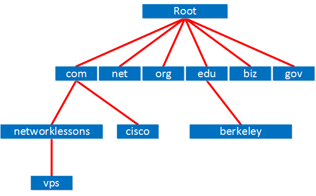
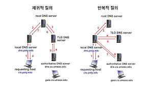
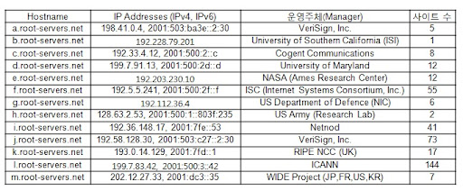
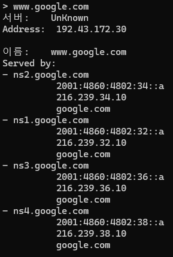
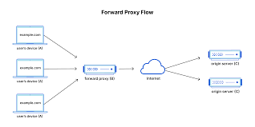
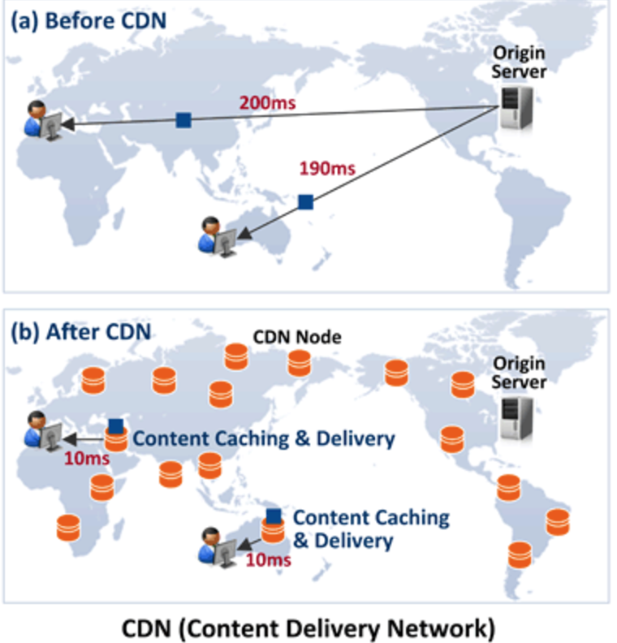

## DNS

DNS는 Domain Name Server의 약자로 우선 이 개념을 말하기 전에 Domain Name에 대해서 말을 해보자. 인터넷에서 특정한 서버는 IP주소로 구분이 된다. 그런데, 사람은 단순히 주소를 구분하기 위해 설정한 숫자값으로만 된 IP 주소를 기억하기는 어렵다. 만약에 8.8.8.8이라고 하면 이게 뭔지 아무도 모르겠지만 www.google.com이라고 말한다면 아 이게 구글에 접속하기 위한 주소이구나를 알 수 있다.

그럼, 이 Domain Name은 굉장히 많을 것이다. 우리도 할당해서 사용할 수 있으니 정말 많을 것이다. 그런데, 이걸 한 서버에서 모두 관리하려고 하는 건 사실상 부하분산이 어렵고, 해당 서버가 다운되버리는 순간 엄청나게 큰 장애로 이어질 것이다. 또한, 지구상에서 물리적 거리에 따라서 너무 먼 곳에 있는 서버에는 서로 신호를 주고 받는 시간이 한참 걸릴 것이다. 따라서, DNS는 분산된 서버에 이를 저장하며 계층적인 구조로 되어있다.

### 1. 계층 구조

아래는 계층에 따른 설명을 컴퓨터 네트워크 하향식 접근의 p117.에서 가져왔다.

- 루트 DNS 서버: 전 세계엔 1000개 이상의 루트 서버 인스턴스가 흩뿌려져있다. 루트 서버는 총 13개가 전 세계적으로 있는데 그 서버에 대한 복사체들이 1000개 있는 것이다. 루트 네임 서버는 TLD 서버의 IP 주소들을 제공한다.
- 최상위 레벨 도메인(TLD) 서버: com, org, net, edu, gov 같은 상위 레벨 도메인과 kr, uk, fr, ca, jp 같은 모든 국가의 상위 레벨 도메인에 대해 다룬다. TLD 서버는 책임 DNS 서버에 대한 IP 주소를 제공한다.
- 책임 DNS 서버: 특정 도메인에 대한 IP 주소와 관련 정보를 저장하고 제공하는 서버이다. 기관은 자체적으로 책임 DNS 서버를 운영하거나, DNS 서비스 제공자에게 위임하여 운영을 맡길 수 있다.

그리고 가져오는 과정은 재귀적 질의와 반복적 질의가 있는데 아래의 이미지를 보면 기억이 날 것이다. 사실 중요한지는 잘 모르겠어서 넘기도록 하겠다.

 
우리가 저 질의를 직접 해볼 수 있다. 루트 DNS 서버의 IP주소는 알려져 있고, windows의 nslookup 명령어를 사용하면 해당 주소에 대해서 얻어올 수 있다.

아래처럼 명령어를 window의 cmd 창에서 써보자. 해당 명령어에 대해서 해석을 하면 다음과 같다. root dns 중 하나의 주소이고 해당 주소에게 www.google.com의 주소를 아냐고 물어보면, 이런 애한테서 얻을 수 있을 것 같은데? 하고 주소 목록을 보여준다. 루트 dns 서버와의 연결을 끊고, 알려준 주소 중 하나에게 질의를 하면 그 다음에는 그 아래의 이미지처럼 구글의 다양한 주소에 관해서 알려준다.
`
> nslookup - 192.228.79.201
> www.google.com
> exit
> nslookup - 192.43.172.30
> www.google.com
`

### 2. 캐싱

매번 주소에 입력을 할 때마다 root DNS 서버에 접근을 해서 해당 Domain Name에 대한 주소를 얻어가는 건 부하적으로도 크고 네트워크적으로도 손해를 많이 볼 것이다. 따라서 이런 네트워크 부하를 줄이기 위해 이전 단계에 캐싱 작업들을 해놓는다.

캐싱 위치 별 분류(아래로 갈 수록 큰 쪽으로 변함.)
- DNS 캐싱: 로컬 메모리에 응답을 받았을 때 저장했다가 사용하는 것이다. 특히, 한 사이트에 대해서 접속하면 해당 사이트를 안 둘러볼 때까지 해당 사이트만 사용하므로 시간 지역성을 잘 활용한 사례인 것 같다.
- hosts 파일: 운영체제 내에서 관리하는 파일로 도메인 이름와 IP 주소를 미리 매핑해놓아 나중에 접근 시 속도를 줄인다.
- 공유기: 공유기도 마치 DNS 서버처럼 동작을 하여 중간에 공유기가 해당 주소에 관해서 알고 있으면 알려줌.
- ISP: 통신 3사와 같이 우리가 계약한 ISP에서 해당 요청을 보고 이미 알고 있는 정보면 IP 주소를 반환해줌.

참고로 캐싱으로 모든 정보를 계속 가지고 있을 수는 없다. 그래서 DNS의 자원 레코드는 다음과 같은 필드를 갖는 튜플로 구성되어있다.

- (Name, Value, Type, TTL)
- Name과 Value의 의미는 Type에 의해서 결정이 된다. 예를 들어 Type이 A이면 Name은 호스트 이름이고  Value는 호스트 이름에 대한 IP 주소이다. 만약 Type이 NS라면 Name은 도메인이고 Value는 도메인 내부의 호스트에 대한 IP 주소를 얻을 수 있는 방법을 아는 책임 DNS 서버의 호스트 이름이다.

### 3. IP 주소에 대한 고찰

DNS 서버에서 가져온 IP는 실제 서버의 IP일까라는 질문에 대해서 생각을 해보면 그럴 수도 있고 아닐 수도 있다라고  말하는 게 맞을 것 같다. 하지만, 서비스의 규모가 어느정도 있고 대규모로 트래픽을 받는 사이트의 경우에는 반드시 아닐 것이라고 생각하는 게 맞을 것 같다.

일단 아무런 처리도 하지 않은 단순히 서버만 있는 경우엔 해당 서버의 IP 주소가 맞을 것이다.

우선 생각해볼 수 있는 첫 번째 관점은 서버를 다중화했을 경우이다. 서버를 다중화한 경우에는 로드밸런서로 앞에서 리버스 프록시 서버와 같은 적절한 분배를 담당하는 서버가 있을 것이다. 해당의 경우에는 실제 요청을 주고 받는 주소의 IP가 아니라 리버스 프록시 서버일 가능성이 높다. 그러면 해당 주소를 받아 해당 서버로 요청을 보내고 리버스 프록시 서버에서 요청을 처리할 수 있는 서버로 분배해 요청을 보내고 다시 받아올 것이다.

만약에 국제 서비스를 지원하는 서비스라면 서비스를 위해 여러 대륙에 뿌려놓은 것 중 현재 사용자가 요청한 곳에 대해서 요청 처리를 잘해줄 수 있는 CDN의 엣지 IP 주소를 알려줄 것이다. 그러면, 해당 서버에게 요청을 보내고 만약에 해당 서버가 요청에 필요한 응답을 미리 캐싱해두는데 가지고 있으면 응답을 내려보낼 것이고 없으면 해당 데이터를 가지고 있는 서버를 찾아 다시 요청하는 방식으로 응답을 내려보낼 것이다.

### 4. CDN 서버

인터넷 비디오 회사와 같이 스트리밍 서비스를 제공하는 사이트에서 만약 단일 거대 데이터 센터를 구축하고 모든 비디오 자료를 저장한 뒤 그곳으로부터 데이터를 전송시키는 방식으로 인프라를 구성한다면 세 가지 문제가 있을 것이다.

- 서버와 클라이언트 패킷 경로에 다양한 통신 경로와 ISP를 거치는데, 다른 대륙에 있는 경우 하나만이라도 원하는 전송속도보다 낮은 전송속도를 가진다면 사용자는 화면이 정지되는 문제를 겪는다.
- 인기 있는 비디오는 캐싱해서 전송할 수 있고, 미리 한 곳에 받아 놓고 미리 있으면 보여주는 방식으로 하면 단일 지점에 대한 부하를 줄일 수 있다.
- 단일 데이터 센터는 단일 장애 지점이 되어 해당 장소에 문제가 생기면 큰 서버의 장애로 이루어지게 된다.

이러한 배경으로 비디오 스트리밍 회사나 데이터를 많이 보내야 하는 회사들은 콘텐츠 분배 네트워크(CDN)을 사용한다. 이러한 CDN은 다수의 지점에 분산된 서버들을 운영해 다양한 웹 콘텐츠 복사본을 분산 서버에 저장한다. 이런 역할을 해주는 CDN으로는 대표적으로 CloudFlare, AWS, Akamai가 있다.

그래서 위와 같은 서비스들의 특징은 DNS에 대해서 일반적으로 그냥 저장하는 게 아니라 지리정보와 관련된 데이터베이스를 이용해서 IP를 지리적으로 모아서 저장을 한 뒤, 해당 정보를 통해서 가장 가까운 클러스터를 선택해 서비스를 제공한다. 

※ 개인적으로 이 내용에 대해서 기억하고 싶다면 인기 있는 영상은 인기 없는 영상보다 전송속도가 빠르다!라고 기억하면 좋을 듯. 인기 없는 영상은 캐싱이 안되어있기 때문에 직접 원본을 서버에서 가져와야 되기 때문에 CDN의 효과를 크게 누릴 수 없기 때문이다.

### 5. 정리

그럼 www.google.com을 쳤을 때 무슨 일이 일어날까를 DNS 서버와 관련해서 언급하면 다음과 같이 할 수 있을 것 같다.

우선 DNS 서버의 관점에 대해서 이야기를 하면 www.google.com을 쳤을 때 해당 도메인에 관한 IP 주소를 얻기 위해 DNS 서버에 질의를 할 것이다. 이 때 만약에 컴퓨터 메모리에 캐싱이 되어있거나 hosts 파일에 이미 접속했던 IP 주소라서 정보가 있다면 굳이 물어보지 않고 IP 주소를 얻어와서 요청을 보낼 것이다. 아니라면 라우터나 ISP가 DNS 서버의 역할을 대신해서 정보를 얻어올 것이고 그 때 조차도 없으면 계층적으로 구성된 DNS 서버로 요청을 보내서 Root, TLD, 책임 DNS 서버 순으로 찾아가면서 IP 주소를 얻어올 것이다.

그런데 그 IP 주소가 실제 서버의 IP 주소는 아닐 수 있다. 소규모 서비스라면 맞을 가능성이 높지만 대규모 트래픽을 받는 곳이라면 여러 다중화된 서버에게 요청을 분배해주는 리버스 프록시 서버에 대한 주소를 얻어온 것이며 해당 서버로 요청을 보내서 응답을 받아올 것이다. 그게 아니라면 국제화된 서버의 경우에는 CDN 클러스터를 만들어 대륙 별로 컨텐츠를 분배할 수 있는 시스템을 만들어놨을 것이며 현재 요청을 보낸 나의 IP주소와 매핑된 지역정보를 활용해 가장 가깝고 원하는 데이터를 빠르게 줄 수 있는 CDN 클러스터로 연결해서 줄 것이다.

---

**참고 자료**

- 컴퓨터 네트워크 하향식 접근 112~124p, 133~140p
- https://www.youtube.com/watch?v=XXzxetbAIfA
- https://www.youtube.com/watch?v=GAyZ_QgYYYo&t=7s
- https://www.youtube.com/watch?v=XXzxetbAIfA
- https://www.youtube.com/watch?v=GAyZ_QgYYYo&t=7s