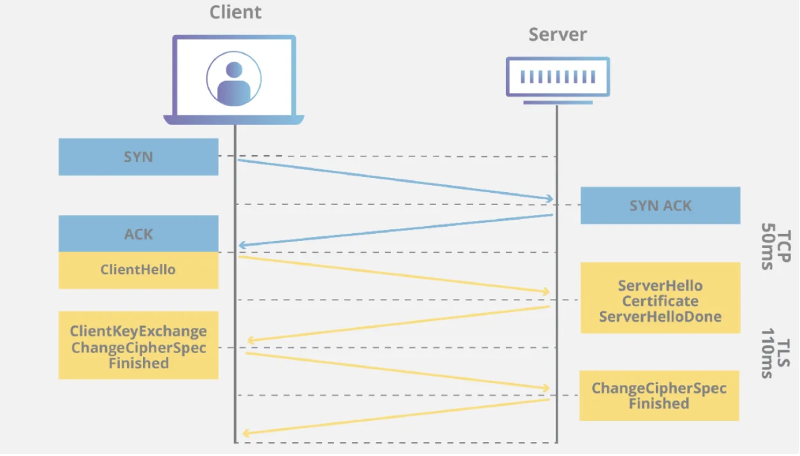
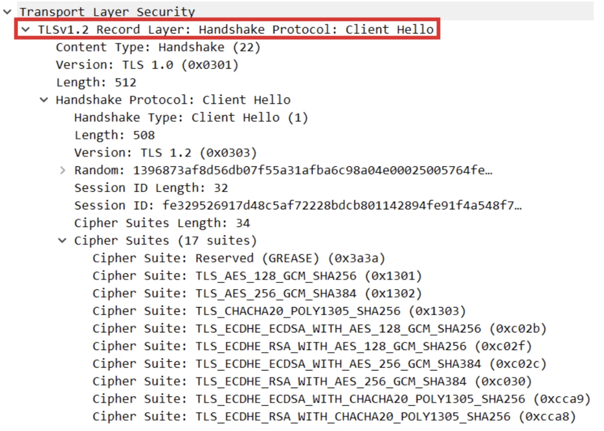
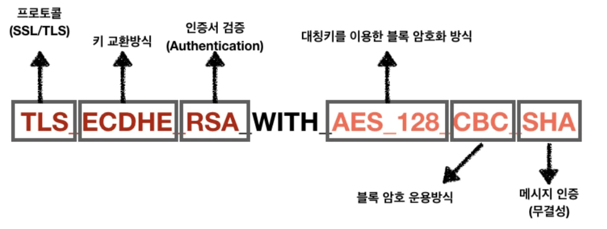
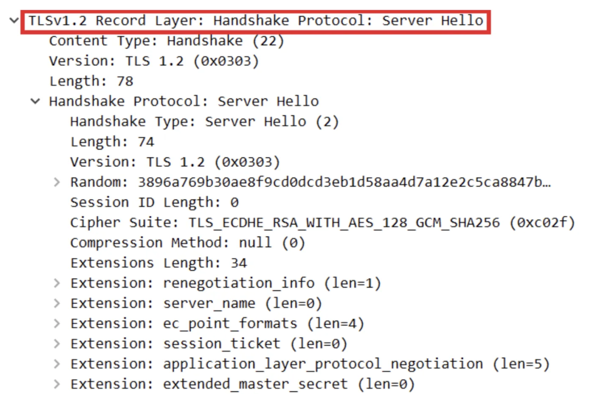
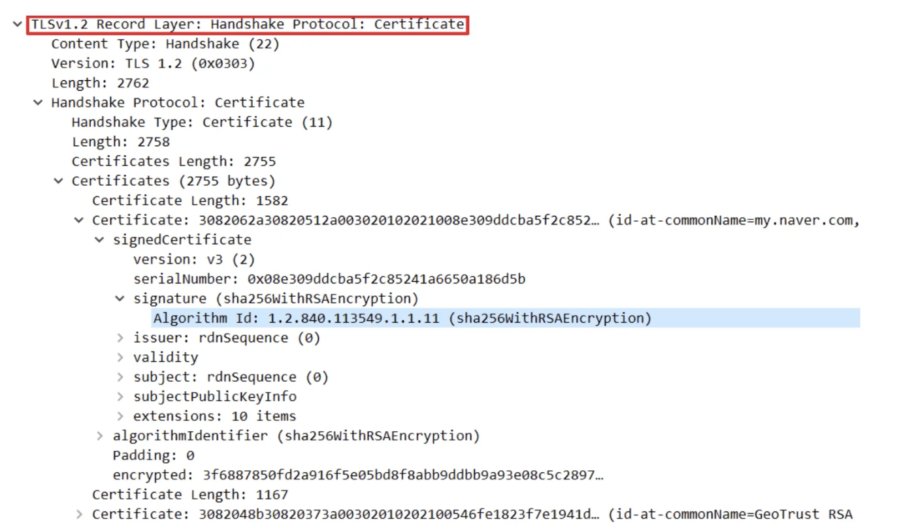
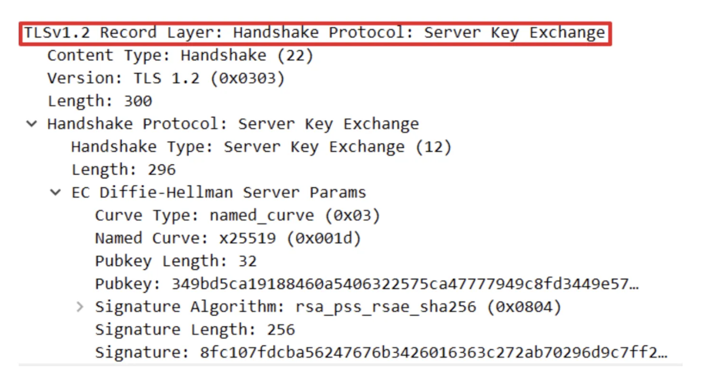
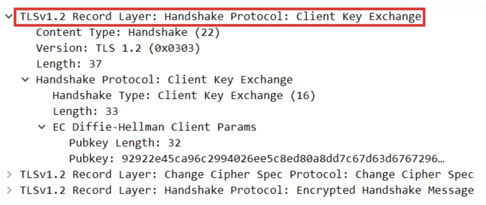
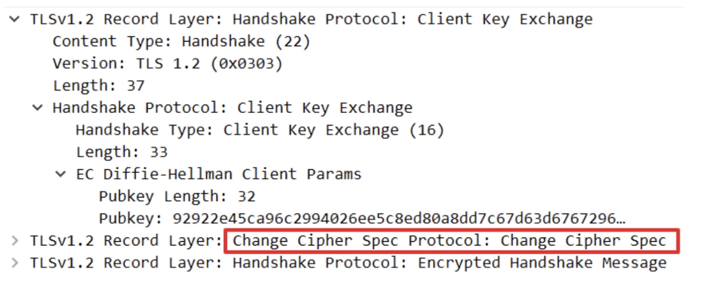

## HTTPS Handshake

TLS가 적용된 HTTP를 HTTPS라고 부른다. 즉 TLS Handshake 과정을 이해하면 된다.  

TLS는 온라인 네트워크에서 데이터를 안전하게 주고받기 위한 암호화 프로토콜이다. 

Handshake 과정

### Client Hello

Client가 Server에게 연결을 시도하는 패킷으로 사용 가능한 Cipher Suite 목록, Session ID, SSL Protocol Version, 넌스 등을 전송한다. 

- 넌스 : 세션키를 생성하는데 사용된다.

### Cipher Suite 구성

무결성 인증 부분이 책에서 나오는 HMAC (SHA-1, MD5,..)

### Server Hello

Server는 Cipher Suite중 하나를 선택하고 서버 넌스와 함께 Client에 전송한다.

### Certificate

추가적으로 Server는 CA에서 발급받은 인증서(CA 개인키로 암호화)를 Client에 보낸다.

-) 추후 클라이언트에서 CA 공개키로 복호화한 후 인증서를 검증하게 된다.

### ServerHelloDone & Server Key Exchange

키 교환 알고리즘에 따라 Server에서 보내는 데이터가 달라진다.

1. Diffie-Hellman(DH, DHE), ECDHE를 사용하는 경우
    
    Server Key Exchange가 추가로 발생한다.
    

Server는 대칭키를 생성할 재료를 보낸다. 이 알고리즘을 사용하는 경우 나중에 Server의 공개키로 암호화해서 대칭키를 공유하지 않고 Client에서 대칭키를 생성할 재료를 Server로 보내게 된다.

- 재료 : EC Diffie-Hellman Server Params

그리고 이렇게 서로 교환한 각자의 재료들을 조합해서 대칭키로 사용한다.

-) EC Diffie-Hellman Server Params + EC Diffie-Hellman Client Params = 대칭키

1. RSA를 사용하는 경우

RSA를 사용하는 경우에는 Server에서 보내는 인증서안에 Server의 공개키가 있기 때문에 Client에서는 이를 CA 공개키로 복호화해서 Server의 공개키를 검증하고 얻으면 된다.

그리고 Client에서는 대칭키를 생성해서 Server의 공개키로 암호화한 후 대칭키를 전송한다.

### Client Key Exchange

위에서 정리한 것처럼 키 교환 알고리즘이 RSA인 경우 대칭키를 Server의 공개키로 암호화해서 Server에 전송한다.

ECDHE 알고리즘을 사용하는 경우에는 EC Diffie-Hellman Client Params와 같이 대칭키를 생성할 재료를 보내게 된다.

-) MS → 2개의 암호화 키와 2개의 HMAC 키로 유도된다. 

E1, E2 (세션 암호화 키)

M1, M2 (전송할 때 보내는 데이터에 대한 HMAC 키)

추후 통신할 때 HMAC을 붙여서 보내고 수신자는 자신이 계산한 값과 비교해서 무결성을 검증하게 된다.

### ChangeCipherSpecFinished

Client, Server 모두 통신할 준비가 끝났음을 알리는 패킷이다.

이후 Server, Client는 암호화된 통신이 가능해진다.

***

references.
- [HTTPS 통신 과정](https://aws-hyoh.tistory.com/39)
- 컴퓨터 네트워킹 하향식 접근