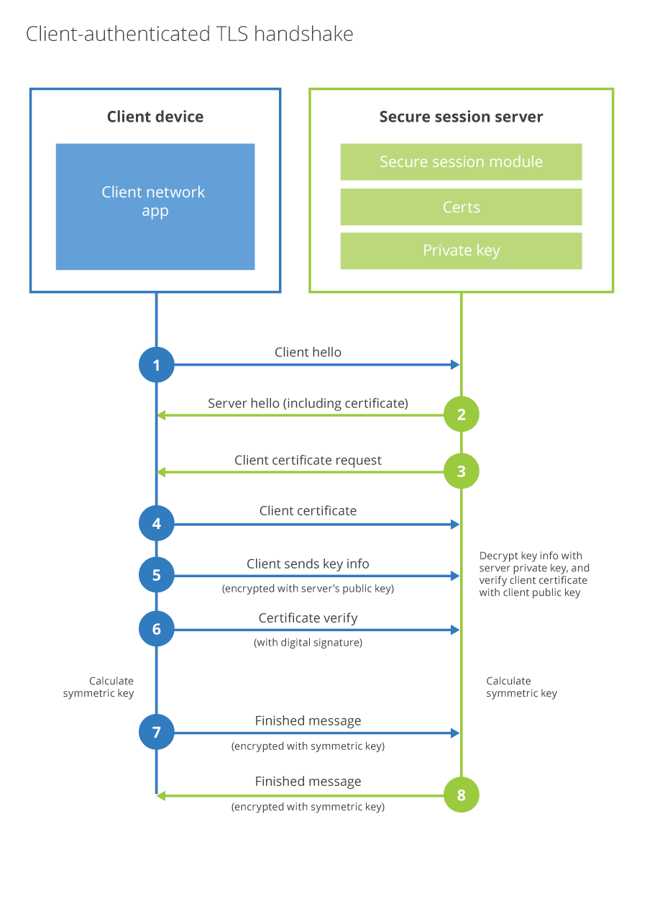

# SSL과 TLS
- SSL(Secure Sockets Layer) : 보안 소켓 계층
  - SSL은 네트워크상의 두 디바이스 또는 애플리케이션 간에 보안 연결을 생성하는 통신 프로토콜이다. 인터넷 연결이나 데이터 공유 전에 신뢰를 구축하고 상대에 대한 인증을 거치는 보안 과정이 필수인데, SSL은 안전하고 암호화된 통신 채널을 만들기 위해 사용하는 기술이다.

- TLS(Transport Layer Security) : 전송 계층 보안 
  - SSL 이라는 이전의 보안 프로토콜에서 발전한 새로운 프로토콜이다. 온라인 네트워크에서 데이터를 안전하게 주고받기 위한 암호화를 진행하여 누군가 데이터를 가로채도 복호화할 수 없도록 점점 높은 수준의 암호화를 제공하고 있다.

## SSL과 비교한 TLS의 등장 배경
SSL은 몇 가지 보안 결함이 있는 오래된 기술이다. TLS는 기존의 SSL 취약점을 보완하는 업그레이드된 SSL 버전이다. TLS는 SSL과 비교하여 더 효율적으로 인증하고 암호화된 통신 채널을 지원한다.

## SSL과 TLS의 주요 차이점 (TLS가 SSL의 결함을 어떻게 보완하는지)

### (1) 암호화 알고리즘 보완
- **SSL 3.0의 문제점**:
    - SSL 3.0에서는 `MAC` (메시지 인증 코드) 생성을 위해 오래된 암호화 알고리즘인 `MD5` 와 `SHA-1` 을 사용했다. 이는 암호화 강도가 약하며, 해시 충돌 공격(collision attack)에 취약하다는 문제가 있었다.
- **TLS에서 개선**:
    - TLS에서는 더 안전한 암호화 알고리즘인 `HMAC` (Hash-based Message Authentication Code)을 도입했다.
    - 특히, TLS 1.2부터는 `SHA-256` 과 같은 강한 해시 알고리즘을 지원하고 있다.

### (2) **핸드셰이크 과정 보안 강화**
- SSL에서는 핸드셰이크 과정에서 일부 중요한 정보가 평문(plaintext)으로 전송될 수 있었다. 이는 공격자가 중간에서 가로채는 중간자 공격(Man-in-the-Middle Attack, MITM)의 위험성이 존재했다.
- TLS는 `Perfect Forward Secrecy (PFS)` 를 통해 핸드셰이크 과정에서 암호화된 키 교환 방식을 강화했다. 이를 통해, 과거의 세션 키가 탈취당해도 해당 세션을 복호화할 수 없도록 만들었다.

### (3) **메시지 인증 및 경고 시스템 개선**
- SSL에서는 오류 메시지나 경고가 암호화되지 않아 공격자에게 취약점을 노출할 수 있다는 단점이 있었다.
- TLS는 오류 메시지와 경고 메시지를 암호화하여 보안성을 높였다. 또한, TLS에는 추가적인 "닫기" 알림이 있어 연결 종료 시 클라이언트와 서버가 올바르게 세션을 종료했는지 확인할 수 있다. (기존 SSL에는 "경고" 알림과  "치명적" 알림만 존재)

### (4) **암호 그룹(Cipher Suite) 유연성 증가**
- 암호 그룹: 브라우저와 서버 간의 정보를 암호화하기 위한 키를 생성하는 알고리즘 모음
- SSL에서는 지원되는 암호 그룹이 제한적이었고, 일부 그룹이 보안 취약점을 가지고 있었다.
- TLS는 더 심화된 암호 그룹을 지원하고, 이를 협상(negotiation)하여 클라이언트와 서버 간에 가장 강력한 보안 설정을 선택할 수 있도록 개선되었다.

TLS 버전의 발전 flow를 살펴볼 때, 버전이 업그레이드 되는 동안 기본적인 암호화 및 인증 방식은 그대로 두고, 암호화 알고리즘, 보안 수준, 성능 향상 등의 발전이 이루어졌다.

- 암호화 알고리즘(암호 그룹) 발전: SSL 3.0에서 TLS 1.2까지 대칭키 암호화와 해시 함수 등 다양한 알고리즘이 개선되었고, 보안 취약점이 발견된 알고리즘들은 더 안전한 알고리즘으로 대체
- 키 길이와 보안 수준 증가: 초기에는 512비트 RSA 키를 사용했지만, 현재는 2048비트 이상의 키 길이를 권장
- 핸드셰이크 과정: TLS의 버전 업그레이드에 따라 핸드셰이크 과정에서 사용하는 프로토콜이나 인증 방식 강화 + 특히, TLS 1.3에서는 0-RTT와 같은 기술이 도입되어 성능도 향상됨

***

# SSL/TLS 인증서
SSL/TLS 인증서는 시스템에서 ID를 확인하고 이후에 SSL/TLS 프로토콜을 사용하여 다른 시스템에 대한 암호화된 네트워크 연결을 설정할 수 있도록 하는 디지털 객체이다. 인증서는 퍼블릭 키 인프라(PKI)로 알려진 암호화 시스템 내에서 사용된다.

## SSL/TLS 인증서 기술
### 1. 암호화: 비대칭 암호화 시스템 (Asymmetric Encryption System)
의도한 수신자만 암호를 복호화할 수 있도록 두 개의 서로 다른 키를 사용하여 메시지를 암호화&복호화한다.

- 퍼블릭 키
브라우저와 웹 서버는 퍼블릭 키 페어와 프라이빗 키 페어를 사용하여 정보를 인코딩 및 디코딩하는 방식으로 통신한다. 
퍼블릭 키는 웹 서버가 SSL/TLS 인증서를 통해 브라우저에 제공하는 암호화 키이고, 브라우저가 웹 서버로 보내기 전에 이 키를 사용하여 정보를 암호화한다.

- 프라이빗 키
프라이빗 키는 웹 서버에만 존재한다. 프라이빗 키로 암호화된 파일은 퍼블릭 키로만 복호화할 수 있으며 그 반대의 경우도 마찬가지이다. 이는 해당 파일의 암호를 복호화할 수 있다는 것 = 의도한 수신자와 발신자라는 것을 의미한다.

### 2. 인증
서버는 SSL/TLS 인증서를 통해 퍼블릭 키를 브라우저로 전송한다. 브라우저는 신뢰할 수 있는 서드 파티의 인증서를 확인하여 웹 서버의 신원을 신뢰할 수 있는지 확인한다.

여기서 서드 파티는 **인증 기관** (CA, Certificate Authority)을 의미한다.

인증 기관(CA)은 웹 서버가 발급받은 SSL/TLS 인증서가 신뢰할 수 있는지 검증해주는 신뢰의 중개자 역할을 한다. 웹 서버가 보유한 퍼블릭 키는 CA가 인증한 서버 인증서에 포함되어 있으며, 브라우저는 이 인증서를 확인하여 서버가 실제로 신뢰할 수 있는 도메인의 소유자인지를 판단한다.

### 3. 디지털 서명
디지털 서명은 모든 SSL/TLS 인증서에 대한 고유 번호이다. 수신자는 새 디지털 서명을 생성하고 원래 서명과 비교하여 네트워크를 통해 전송되는 인증서를 조작하지 않았는지 확인할 수 있다.

## SSL/TLS HandShake 과정
- 핸드셰이크는 브라우저가 서버의 SSL/TLS 인증서를 인증하는 프로세스이다. 이 프로세스는 양 당사자를 인증한 다음 암호화 키를 교환한다.
- SSL 핸드셰이크는 명시적 연결인 반면 TLS 핸드셰이크는 암시적 연결이다. SSL 핸드셰이크 프로세스는 TLS 프로세스보다 단계가 더 많다는 단점이 있었는데, TLS에서는 추가 단계를 제거하고 총 암호 그룹 수를 줄여서 프로세스 속도를 높였다.

- 클라이언트 헬로
  - 클라이언트는 서버에 "클라이언트 헬로" 메시지를 보내면서 핸드셰이크를 시작한다. 
  - 이 메시지에는 클라이언트가 지원하는 TLS 버전, 무작위 바이트 문자열(클라이언트 랜덤 값), 클라이언트가 지원하는 암호 그룹 목록이 포함된다.

- 서버 헬로
  - 서버는 "서버 헬로" 메시지로 응답한다. 서버의 디지털 인증서, 서버가 선택한 암호 그룹, 그리고 서버가 생성한 무작위 바이트 문자열(서버 랜덤 값)이 메시지에 포함된다.

- 키 교환
  - 클라이언트는 서버의 인증서를 검토하여 서버가 해당 도메인의 소유자인지 확인한다. 
  - 확인이 완료되면 세션 키를 안전하게 생성하기 위해 키를 교환한다. 
  - 클라이언트와 서버 모두 각자의 랜덤 값과 교환된 키 데이터를 사용해서 동일한 세션 키를 생성한다.

- 클라이언트 완료 및 서버 완료
  - 세션 키가 생성되면, 클라이언트는 세션 키로 암호화된 "Change Cipher Spec" 메시지와 "Finished" 메시지를 서버에 전송한다.
  - 서버도 마찬가지로 "Change Cipher Spec"과 "Finished" 메시지를 클라이언트에 전송하며, 이 시점부터 모든 통신은 세션 키를 사용해 암호화된다.

***

references.
- [AWS SSL and TSL ](https://aws.amazon.com/ko/compare/the-difference-between-ssl-and-tls/)
- [AWS SSL certificate](https://aws.amazon.com/what-is/ssl-certificate/)
- [Understanding SSL and TLS](https://www.itworld.co.kr/article/3572834/ssl-tls%EC%9D%98-%EC%9D%B4%ED%95%B4%EC%99%80-tls-1-3%EC%9C%BC%EB%A1%9C-%EC%97%85%EA%B7%B8%EB%A0%88%EC%9D%B4%EB%93%9C%ED%95%B4%EC%95%BC-%ED%95%98%EB%8A%94-%EC%9D%B4%EC%9C%A0.html)
- [TLS by tosspayments](https://docs.tosspayments.com/resources/glossary/tls)
- [TLS with Client Authentication](https://blog.cloudflare.com/introducing-tls-client-auth/)
- 학부생 때 공부했던 자료