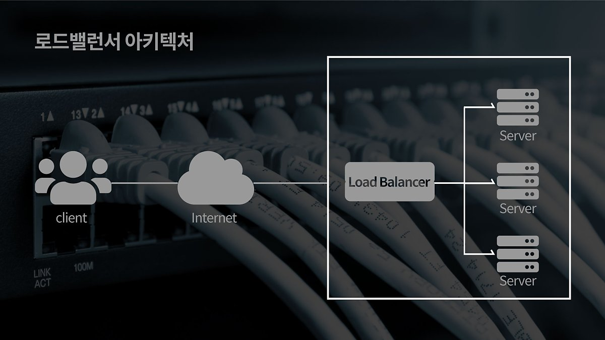

## 로드 밸런서

로드 밸런서는 웹 서버 또는 웹 애플리케이션 서버 앞에 위치하며 여러 서버에 적절하게 트래픽을 분산하는 소프트웨어 또는 하드웨어 장치이다. 클라이언트의 요청을 여러 서버에 분배함으로써 특정 서버에 과부하가 걸리지 않고 시스템이 안정적으로 작동하도록 돕는다. 또한, 새로운 버전의 애플리케이션을 배포할 때 로드 밸런서를 사용해 기존 서버에서 새로운 서버로 트래픽을 점진적으로 전환하거나 배포 중 오류가 발생한 경우 트래픽을 빠르게 롤백할 수 있다.

### 1. 로드 밸런서 종류

로드 밸런서는 OSI 7계층을 기준으로 나뉘며, 상위 계층으로 갈수록 하위 계층의 기능을 포함하면서 더욱 정교한 로드 분산이 가능하다.

일반적으로 L4 로드 밸런서와 L7 로드 밸런서가 가장 많이 사용되며, 이는 L4 이상부터 포트 번호를 기반으로 부하를 분산할 수 있기 때문이다. 만약 하나의 서버에서 여러 포트를 부여하여 다양한 프로그램을 실행하는 경우 최소 L4 이상의 로드 밸런서를 사용해야 한다. L4 로드 밸런서와 L7 로드 밸런서의 가장 큰 차이는 패킷의 내용 확인 여부이다.

- **L4 로드 밸런서**
    
    

    네트워크 계층(IP) 및 전송 계층(TCP, UDP)의 정보를 바탕으로 트래픽을 분산하기 때문에 IP 주소, 포트 번호, MAC 주소, 전송 프로토콜 등을 기준으로 부하를 분산할 수 있다.
    
    패킷의 내부 데이터를 분석하지 않고 로드 분산을 수행하므로 속도가 빠르고 비용이 저렴하다. 하지만 데이터 복호화를 수행하지 않으므로 데이터 패킷의 내용에 기반한 정교한 라우팅이나 세밀한 보안 정책 적용은 어렵다. 또한 사용자의 IP 주소가 자주 바뀌는 환경에서는 로드 밸런서가 동일한 사용자를 인식하지 못하고, 세션을 다른 서버로 분배할 가능성이 높기 때문에 지속적인 서비스 제공이 어려울 수 있다.
    
- **L7 로드 밸런서**
    
    

    애플리케이션 계층(HTTP, FTP, SMTP)에서 트래픽을 분산하기 때문에 HTTP 헤더나 쿠키 같은 클라이언트 요청의 내용을 기준으로 부하를 분산할 수 있다. 예를 들어 URL 경로나 쿠키 값을 기반으로 서버를 선택하거나, 특정 패턴을 가진 바이러스 트래픽을 차단할 수 있다. 이를 통해 보다 세밀한 라우팅과 네트워크 보안이 가능하며, DoS/DDoS 공격을 사전에 필터링하여 서비스 안정성을 높일 수 있다.
    
    또한, 패킷의 내용을 기준으로 캐싱이 가능하기 때문에 클라이언트의 요청을 최적화할 수 있다. 그러나 패킷 내용을 복호화해야 하므로 처리 속도가 느리고, 상대적으로 비용이 높다. 그리고 암호화된 트래픽(HTTPS)을 처리하는 과정에서 데이터가 잠재적으로 노출될 위험이 있다. 이를 방지하기 위해 SSL 종료 지점에서 보안 설정을 철저히 관리해야 한다.
    

### 2. 로드 밸런싱 알고리즘

로드 밸런싱 알고리즘은 로드 밸런서가 클라이언트 요청을 처리할 서버를 선택하는 방식을 의미하며, 정적 로드 밸런싱과 동적 로드 밸런싱으로 나눌 수 있다.

1. **정적 로드 밸런싱**
    
    고정된 규칙에 따라 트래픽을 서버에 분배하며, 서버의 현재 상태와는 관계없이 작동한다.
    
    - **라운드 로빈 방식**
        
        서버의 IP 주소를 순차적으로 반환하며, 모든 서버가 순서대로 클라이언트 요청을 처리하도록 트래픽을 분산하는 방식이다. 서버와의 세션이 오래 유지되지 않고, 모든 서버가 동일한 처리 능력을 가진 경우에 적합하다. 보통 DNS 서버가 소프트웨어나 하드웨어 장치 대신 로드 밸런싱을 수행하며, 요청이 들어오면 서버 IP 주소를 차례로 반환한다.
        
    - **가중치 라운드 로빈 방식**
        
        각 서버의 처리 능력에 따라 가중치를 부여하고, 가중치에 비례하여 트래픽을 분배한다. 처리 성능이 더 높은 서버가 더 많은 요청을 처리할 수 있도록 구성되며, 서버 간 성능 차이가 큰 환경에서 효과적이다.
        
    - **IP 해시 방식**
        
        클라이언트의 IP 주소를 해싱하여 특정 서버에 매핑하는 방식이다. 동일한 클라이언트가 항상 동일한 서버에 연결되기 때문에 세션 유지를 필요로 하는 애플리케이션에 적합하다.
        
2. **동적 로드 밸런싱**
    
    서버의 현재 상태를 실시간으로 확인한 후, 이를 기반으로 트래픽을 분산하는 방식이다.
    
    - **최소 연결 방식**
        
        현재 활성 연결이 가장 적은 서버를 선택하여 트래픽을 전달한다. 모든 연결이 서버에 동일한 부담을 준다는 가정 하에 서버 간 부하를 균등하게 분산할 수 있다. 세션이 길어지거나 서버에 가해지는 트래픽이 일정하지 않은 경우에 유용하다. 세션이 길어지는 경우가 많거나 서버에 분배된 트래픽들이 일정하지 않은 경우에 적합하다.
        
    - **가중치 최소 연결 방식**
        
        각 서버의 처리 능력에 따라 가중치를 부여하고, 가중치를 고려하여 활성 연결이 가장 적은 서버로 요청을 보낸다. 최소 연결 방식을 기반으로 하되, 성능이 더 뛰어난 서버가 더 많은 트래픽을 처리할 수 있도록 한다.
        
    - **최소 응답 시간 방식**
        
        서버의 평균 응답 시간과 활성 연결 수를 조합하여 가장 효율적인 서버를 선택한다. 응답 시간이 짧고, 연결이 적은 서버를 우선으로 선택하여 사용자에게 빠른 응답을 제공한다. 실시간으로 서버 성능을 고려하므로 사용자 경험 향상에 적합하다.
        
    - **리소스 기반 방식**
        
        서버의 CPU, 메모리 등 현재 사용 가능한 리소스를 분석하여 트래픽을 분배한다. 각 서버에서 실행되는 **에이전트** 소프트웨어가 리소스 상태를 측정하며, 로드 밸런서는 이를 기반으로 여유가 있는 서버로 요청을 전달한다. 이 방식은 고부하 환경에서도 안정적인 서비스 제공에 유리하다.
        

### 3. 장애 예방 및 처리

1. **헬스 체크 (Health Check)**
    
    로드 밸런서는 헬스 체크를 통해 정기적으로 연결된 서버의 상태를 모니터링한다. 이 과정에서 서버의 응답 상태를 확인해 정상적인 동작이 불가능한 서버를 자동으로 트래픽 분배 대상에서 제외한다.
    
    이때 헬스 체크 주기와 실패 임계값을 적절히 설정하여 서버 상태를 지나치게 민감하거나 둔감하게 평가하지 않도록 조정해야 한다. 헬스 체크 주기 설정이 너무 길면 장애 대응이 지연될 수 있고, 너무 짧으면 네트워크와 서버에 불필요한 부하를 줄 수 있다.
    
2. **장애 조치 (Failover)**
    
    하나의 서버가 고장나더라도 서비스가 중단되지 않도록 장애가 발생한 서버의 트래픽을 다른 서버로 자동 전환한다. 이때 로드 밸런서는 지연 시간을 고려하며 장애 조치 로직을 최적화해 가장 적합한 서버로 트래픽을 유도할 수 있어야 한다.
    
    또한, 다중 로드 밸런서를 설정해 주 로드 밸런서가 고장나도 보조 로드 밸런서가 동작하도록 할 수 있다. 이때 다중 로드 밸런서 간의 헬스 체크를 통해 높은 가용성을 유지해야 한다.
    
3. **자동 복구 (Auto Healing)**
    
    클라우드 환경에서는 고장난 서버를 자동으로 로드 밸런싱 대상에서 제외한 뒤 복구된 서버를 자동으로 다시 포함하거나, 혹은 새로운 서버 인스턴스를 생성해 기존 서버를 대체하도록 설정할 수 있다.

---

**참고 자료**

- https://www.cloudflare.com/ko-kr/learning/performance/types-of-load-balancing-algorithms/
- https://aws.amazon.com/what-is/load-balancing/?nc1=h_ls
- https://post.naver.com/viewer/postView.nhn?volumeNo=27046347&memberNo=2521903