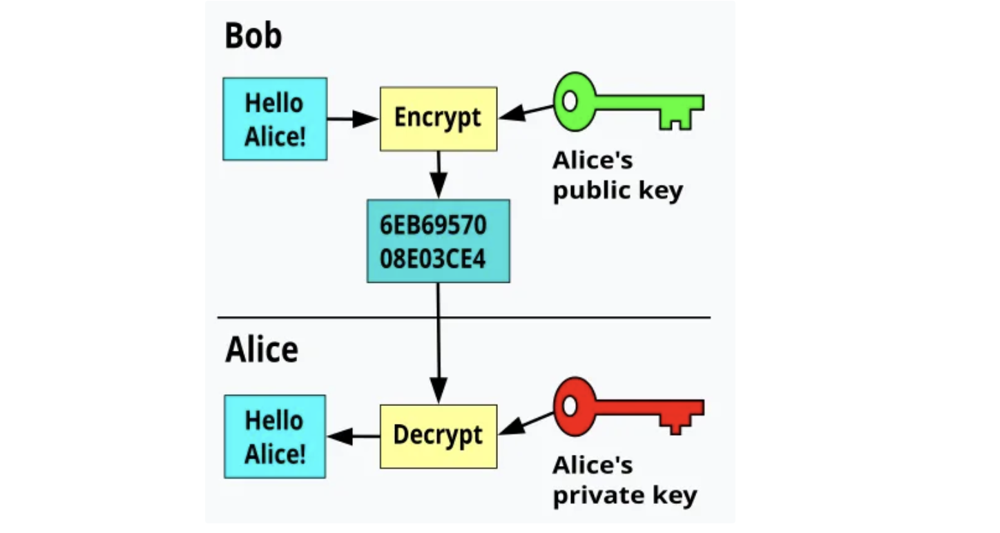

## 대칭키
    
대칭키 암호는 암-복호화에 동일한 키를 쓰는 알고리즘을 말한다. 이 방식에서는 송수신측 모두 같은 암호키를 공유해야 한다. 일반적으로 공개키 암호화에 비해서 계산 속도가 빠르다. 하지만 대칭키의 경우 키 교환에 보안 이슈가 있을 수 있다. 
    
**유형**
    
* 블록 암호 : AES와 같은 블록 암호는 고정 크기 블록의 데이터를 암호화한다.
    
* 스트림 암호 : 한 번에 한 비트 또는 바이트씩 데이터를 암호화하여 실시간 데이터 처리에 적합하다.
    
일반적으로 대량의 데이터에 대한 무결성, 보안을 보장하기 위해 블록 암호 방식을 많이 사용한다. 하지만 실시간 통신과 같은 더 작과 연속적인 데이터 스트림을 효율적으로 암호화할 때는 스트림 암호를 사용하게 된다.
    
**키 교환 방식**
    
대칭키를 교환할 때 2가지 정도의 방법을 사용한다.
    
1. RSA : (공개키, 비밀키 사용) 송신자는 수신자의 공개키를 사용하여 대칭키를 암호화해서 전송하고 이는 수신자만 복호화할 수 있기 때문에 안전하게 키를 배포할 수 있다.
2. Diffie-Hellman : 이 방식은 사전 공유 암호 없이 안전하지 않은 채널을 통해 대칭키와 같은 공유 암호를 생성할 수 있다. 중간에 공격자가 가로채더라도 복잡한 연산이 요구되기 때문에 안전하게 키를 배포할 수 있다.

## 비대칭키

비대칭키 암호화는 암-복호화에 서로 다른 키를 사용한다. 송신자는 수신자의 공개키를 이용하여 암호화하고 수신자는 자신의 개인키로 복호화한다.
공개키 암호는 수학적 난제를 기반으로 설정되어 암복호화에 복잡한 수학 연산이 사용되기 때문에 대칭키 암호에 비해 느리다. 하지만 여러 송신자가 하나의 공개키로 암호화를 수행하기 때문에 사용자가 많더라도 키 관리에 유리하다.
대표적으로 RSA, ElGamal, ECC 등이 있다.

ex1)

1. Bob이 Alice에게 Hello Alice라는 평문을 전송할 때 Alice의 공개키로 암호문을 생성하고 보낸다.

2. Alice는 암호문을 자신의 개인키로 복호화하여 메시지를 읽는다. (Alice만 private Key를 가지기 때문에 다른 사람은 볼 수 없음.)

**전자서명**
전자서명을 할 때도 사용할 수 있다. 전자서명이란 본인이 본인임을 증명할 때 사용하는 수단인데 개인키를 소유한 사람만이 전자 서명 알고리즘을 통해 평문에 대한 서명을 생성할 수 있다. 이는 공개키로 검증이 가능하다. 대표적으로 DSA, RSA, Signature, ECDSA 알고리즘이 있다.

***

references.
- [대칭키 암호](https://ko.wikipedia.org/wiki/%EB%8C%80%EC%B9%AD_%ED%82%A4_%EC%95%94%ED%98%B8)
- [대칭 암호화](https://www.ibm.com/kr-ko/think/topics/symmetric-encryption)
- [공개키 암호화](https://ko.wikipedia.org/wiki/%EA%B3%B5%EA%B0%9C_%ED%82%A4_%EC%95%94%ED%98%B8_%EB%B0%A9%EC%8B%9D)
- [암호화 종류](https://seed.kisa.or.kr/kisa/intro/EgovDefinition.do)