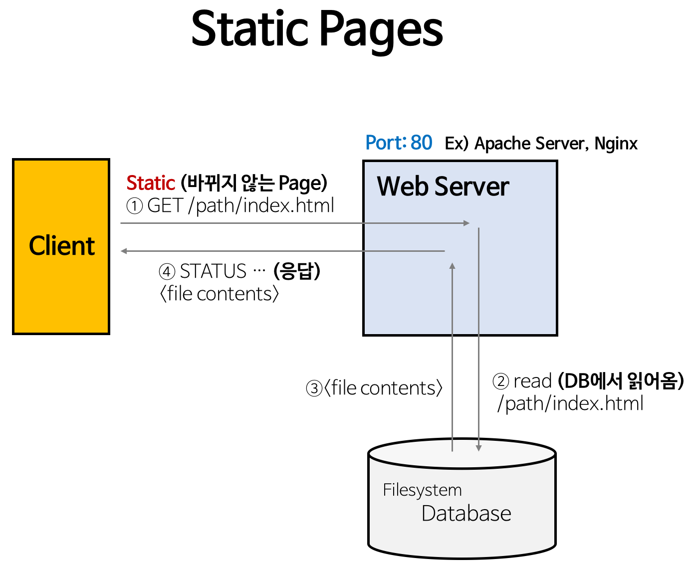
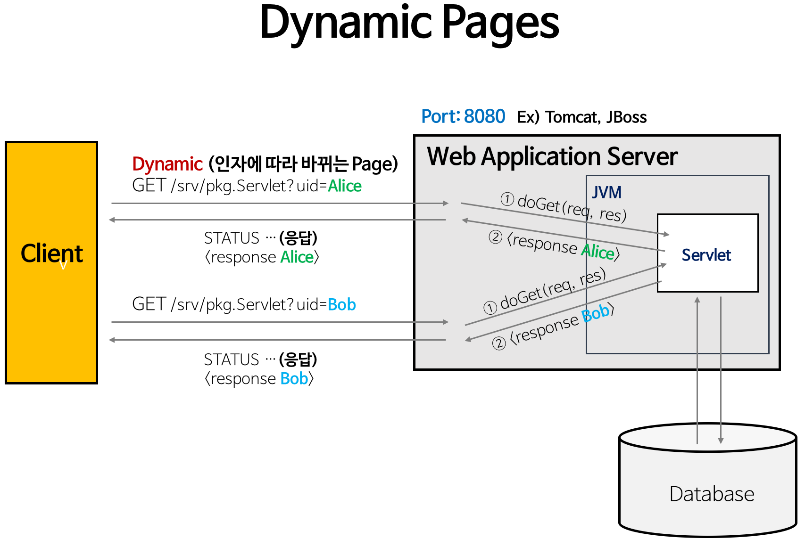

## Web Server와 Web Application Server

웹 서버와 애플리케이션 서버는 클라이언트-서버 아키텍처에서 데이터를 제공하는 소프트웨어이다. 웹 서버는 정적인 콘텐츠를 빠르고 효율적으로 제공하는 데 중점을 두며, 애플리케이션 서버는 비즈니스 로직을 통해 동적인 콘텐츠를 생성하고 사용자 상호작용을 지원한다.

두 서버는 상호보완적으로 동작하며, 대부분의 현대 웹 애플리케이션 환경에서는 이 두 가지 기능이 통합된 하이브리드 서버를 사용한다. 예를 들어, Nginx는 정적 콘텐츠 제공과 함께 웹 애플리케이션 서버의 로드 밸런서 역할을 수행하며, Spring Boot는 내장된 웹 서버(Tomcat 등)를 통해 정적 콘텐츠와 동적 콘텐츠를 모두 처리할 수 있다.

### 1. Web Server

웹 서버는 HTML, CSS, JavaScript, 이미지, 비디오 등의 정적인 데이터를 제공한다. 정적인 콘텐츠를 제공하는 블로그나 간단한 웹사이트는 웹 서버만으로도 충분하다. 웹 서버는 주로 HTTP 프로토콜을 사용하며, FTP와 SMTP와 같은 프로토콜도 지원한다. Apache, Nginx 등이 대표적인 웹 서버이다. 웹 서버는 다음과 같은 과정을 통해 클라이언트의 요청을 처리한다.

1. 사용자가 브라우저에서 URL을 입력한다.
2. 브라우저가 URL을 사용해 웹 서버의 IP 주소를 찾는다.
3. 브라우저가 HTTP 요청을 웹 서버로 보낸다.
4. 웹 서버가 파일 시스템에서 요청에 맞는 정적 콘텐츠를 검색한다.
5. 요청된 정적 콘텐츠를 HTTP 응답에 담아 브라우저에게 반환한다.
6. 브라우저가 응답 받은 콘텐츠를 사용자에게 표시한다.

### 2. Web Application Server

웹 애플리케이션 서버는 웹 서버의 기능을 확장하여 동적 콘텐츠 생성과 비즈니스 로직 처리를 담당한다. 웹 애플리케이션 서버는 런타임 환경에서 애플리케이션 코드를 실행하고, 데이터베이스나 메시징 큐(Message Queue)와 같은 다양한 구성 요소와 상호 작용하여 동적인 데이터를 생성한다. Tomcat, Jetty 등이 대표적인 웹 애플리케이션 서버이다. 웹 애플리케이션 서버는 다음과 같은 과정을 통해 클라이언트의 요청을 처리한다.

- **웹 서버와 웹 애플리케이션 서버가 분리된 경우**

    1.   사용자가 브라우저에서 동적인 콘텐츠를 요청한다.
    2.   브라우저가 URL을 사용해 웹 서버의 IP 주소를 찾는다.
    3.   브라우저가 HTTP 요청을 웹 서버로 보낸다.
    4.   웹 서버가 요청을 웹 애플리케이션 서버로 전달한다.
    5.   웹 애플리케이션 서버가 요청을 직접 처리하거나, 외부 시스템과 통신하며 비즈니스 로직을 수행한다.
    6.   처리 결과를 바탕으로 새로운 HTML 페이지나 XML, JSON 등의 데이터를 생성하여 웹 서버로 반환한다.
    7.   웹 서버가 생성된 데이터를 클라이언트 브라우저에게 응답한다.
    8.   브라우저가 결과를 사용자에게 표시한다.
  
- **웹 서버 기능이 내장된 웹 애플리케이션 서버인 경우**

    1. 사용자가 브라우저에서 동적인 콘텐츠를 요청한다.
    2. 브라우저가 URL을 사용해 웹 애플리케이션 서버의 IP 주소를 찾는다.
    3. 브라우저가 HTTP 요청을 웹 애플리케이션 서버로 보낸다.
    4. 웹 애플리케이션 서버가 요청을 직접 처리하거나, 외부 시스템과 통신하며 비즈니스 로직을 수행한다.
    5. 처리 결과를 바탕으로 새로운 HTML 페이지나 XML, JSON 등의 데이터를 생성하여 클라이언트 브라우저에게 응답한다.
    6. 브라우저가 결과를 사용자에게 표시한다.

### 3. 차이점

1. **작업 범위**
    
    웹 서버는 간단한 요청에 대한 정적 콘텐츠를 제공한다. 반면, 애플리케이션 서버는 비즈니스 로직을 처리하고 데이터베이스, 서드 파티 서비스 등과 통합하여 동적 콘텐츠를 생성한다. 이때 서드 파티 서비스는 애플리케이션 외부에서 제공되는 서비스로 PayPal과 같은 결제 서비스나 Google Maps API 같은 지도 서비스 등을 말한다.
    
2. **프로토콜**
    
    웹 서버는 HTTP를 기본으로 사용하며, FTP와 SMTP도 지원한다. 반면, 애플리케이션 서버는 웹 서버에서 사용하는 프로토콜 외에도 원격 메소드 호출(Remote Method Invocation)과 원격 프로시저 호출(Remote Procedure Call)과 같은 프로토콜을 추가로 사용하여 다양한 소프트웨어 구성 요소와 통신한다.
    
3. **콘텐츠 유형**
    
    웹 서버는 HTML 페이지, 이미지, 비디오, 파일과 같은 정적 콘텐츠를 제공한다. 반면, 애플리케이션 서버는 실시간 업데이트, 개인화된 정보, 데이터베이스 결과 등과 같은 동적 콘텐츠를 제공한다.
    
4. **멀티스레딩**
    
    웹 서버는 멀티스레딩을 지원하기도 하지만, 일반적으로 Nginx와 같은 이벤트 기반 서버는 멀티스레딩 대신 non-blocking I/O와 이벤트 루프를 활용하여 요청을 처리한다. 반면, 애플리케이션 서버는 멀티스레딩을 활용하여 높은 확장성과 효율성을 제공하며 동시에 여러 클라이언트 요청을 병렬로 처리할 수 있다.
    
---

**참고 자료**

- https://aws.amazon.com/compare/the-difference-between-web-server-and-application-server/?nc1=h_ls