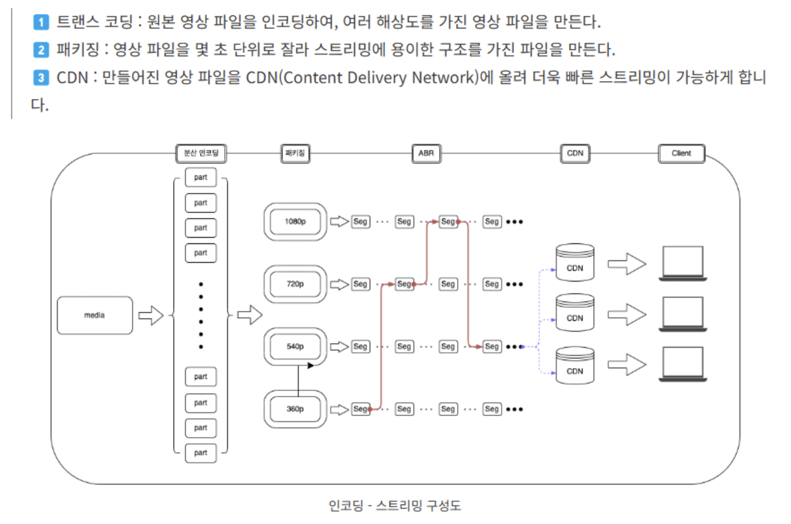

# 인코딩(Encoding)

## 정의

인코딩이란 데이터를 다른 형식으로 변환하는 과정으로,데이터 전송 중 **무결설 보장**, **압축**, 또는 **효율적인 전송**을 위해서 사용된다.

## 인코딩 종류

### 1. 텍스트 데이터 인코딩

텍스트 데이터를 디지털 장치에서 표현 가능한 바이너리 형태로 변환한다.

### 종류

- **ASCII**
  
  - 7비트로 128개의 문자 표현
  - 제한된 문자 세트(영문, 숫자, 일부 특수문자)
  - 주로 레거시 시스템에서 사용하고 현재는 서비스에서 거의 사용 X
  
- **UTF-8**
  
  - 가변 길이 인코딩으로, 1~4바이트로 문자 표현 (영어 및 ASCII 문자는 1바이트, 다른 문자는 2바이트 이상, 한글은 3바이트)
    -  시작하기 전에 첫 바이트에 몇 바이트를 사용하는지 알려주는 비트를 추가된다.
  - 전 세계 대부분의 언어를 표현 가능하여 웹 표준에서 기본 인코딩으로 채택
    - 추가적으로 ASCII로 된 HTML 태그 혹은 자바스크립트로 구성된 과거 사이트에 대해서 별도의 변환 처리를 하지 않고 그대로 사용할 수 있어서 좋다.
  
- **EUC-KR**
  - 한글을 표현하기 위한 2바이트 인코딩
  
  - UTF-8로 전환하기 이전의 한국어 서비스에서 많이 사용
  
    - EUC-KR, CP949는 한글 부분에 있어서  2바이트 인코딩을 사용하는데 UTF-8은 3바이트를 사용하여 한글이 깨지는 현상이 발생한다.
  
      

### 2. 전송 데이터 인코딩

네트워크를 통해 데이터를 전송하기 위한 변환이다.

### 종류

- **Base64 인코딩**
  - 바이너리 데이터를 텍스트 형태로 변환
  - 이메일 첨부파일, JSON 내 이미지 포함 등에 사용

- **URL 인코딩**

  - URL에 포함할 수 없는 특수문자를 `%`와 ASCII 코드로 변환, 이를 통해서 데이터 손실, 변조 없이 전달할 수 있게 한다.
  - 예: 공백( ) → `%20`, 슬래시(/) → `%2F`
  - GET/POST 요청의 쿼리 파라미터를 인코딩할 때 필수적
    - 쿼리 스트링을 통해 데이터를 전송할 때 파라미터 구분자와 문자에 차이를 두어야 함
  - XSS 공격과 같은 보안 취약점을 방지하기 위해서도 중요 (사용자 입력에 악성 스크립트 주입 방지)

    - <script> 태그를 사용해서 URL 쿼리 스트링을 통해 삽입하려고 할 때, <, > 같은 특수 문자가 URL로 인코딩되어 %3C, %3E로 변환된다. 이를 통해 일반 문자로 인식된다.
  - 대부분의 언어, 웹 프레임워크에서 URL encoding 을 위한 내장 함수나 라이브러리를 지원하므로 활용하기
- **HTTP 헤더 압축 인코딩 (Content-Encoding)**
  - 데이터를 전송하기 전 압축
  - 예: gzip, Brotli
  - 데이터 전송량을 줄여 네트워크 성능 향상

### 3. 멀티미디어 인코딩

오디오, 비디오와 같은 멀티미디어 데이터를 효율적으로 압축 및 전송하기 위한 변환이다.

### 종류

- **MP3 (오디오)**
  - 손실 압축 방식으로, 용량을 줄이는 데 효과적이다.
  - 편하고 시장 점유율이 좋아 오디오 한정으로 많이 쓰이는 방식이나, 유튜브 등 영상 분야에서는 `.m4a` `.acc` 로 교체되었다.
- **H.264 (비디오)**
  - 고효율 비디오 압축 표준이다.
  - 압축률과 화질을 모두 고루 챙긴 스펙이어서 스트리밍 서비스(ex. YouTube, Netflix)에서 널리 사용되고 있다.

## 인코딩, 디코딩 설정이 중요한 상황

- 데이터 직렬화/역직렬화 과정

- 파일 업로드/다운로드 시 인코딩 방식 적절하게 설정

- DB에서 데이터 인코딩 방식 차이로 인한 깨짐 문제

- 다국어 지원 서비스에서 문자 인코딩 주의 (UTF-8)

  - 서버와 클라이언트 간 UTF-8 방식으로 일치 필요

- 스트리밍 데이터 처리시 압축률, 해상도, 손실률을 고려한 인코딩 방식 채택

  - 실시간 데이터 처리를 위한 효율적인 코덱과 압축 방식 (H.264, Opus)

  - 실시간 네트워크 상황에 따른 화질 변경 (트랜스코딩을 통한 구현)
    -> 서비스 관점에서 인코딩 핵심 포인트는 사용자가 최상의 경험을 할 수 있도록 미디어 용량을 낮추면서 동시에 화질을 최대한 유지하는 일 (이를 어떤 인코딩 옵션을 통해 구현할 지 판단)
    
    
    
    

  

- 커스텀 데이터 포맷 (커스텀 페이로드) 구축 시 타입별 포맷에 맞는 커스텀 코덱 사용 (멀티미디어 환경에서)

  - Netty 등 프레임워크에서 제공하는 라이브러리 `io.netty.handler.codec` 를 활용해 타입별 포맷에 맞는 구현체 개발 가능

------

references.

- [UTF-8](https://ko.wikipedia.org/wiki/UTF-8)
- [Base64](https://developer.mozilla.org/ko/docs/Glossary/Base64)
- [Usage of URL encoding](https://f-lab.kr/insight/importance-and-usage-of-url-encoding)
- [Live Stream Encoding](https://www.cloudflare.com/ko-kr/learning/video/live-stream-encoding/)
- [스트리밍 서비스 개발 - 영상 서비스 인코더와 라이브 서비스 트러블슈팅](https://kakaoentertainment-tech.tistory.com/119)
- [멀티미디어 소셜 서비스 개발 - 커스텀 페이로드 정의 & 타입별 인코딩, 디코딩](https://techblog.woowahan.com/2681/)