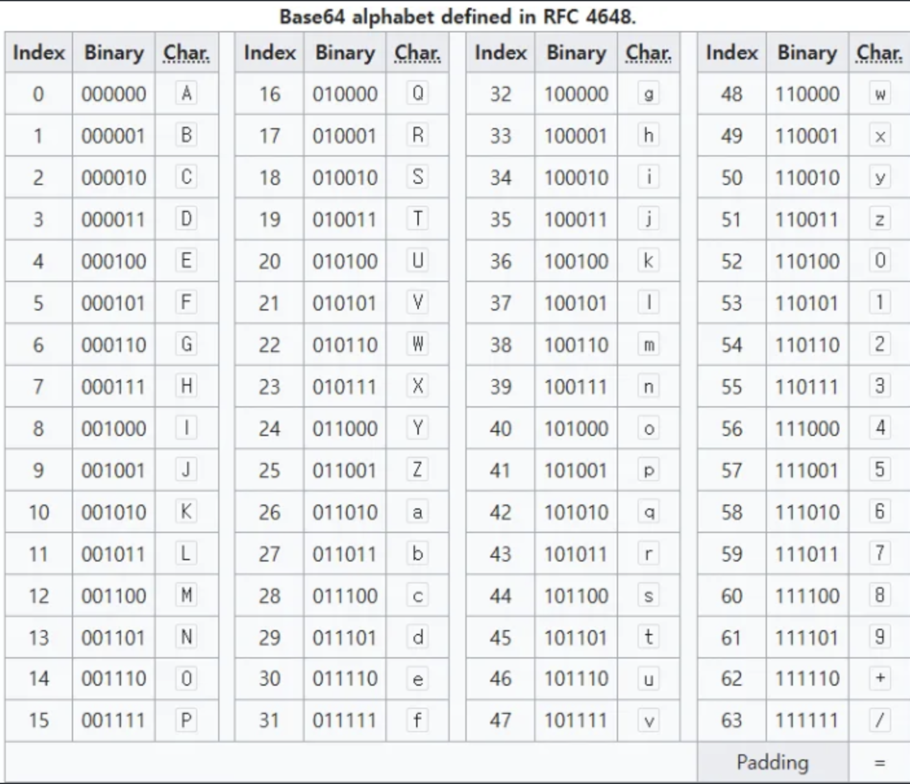

# BASE64란?

BASE64는 자료에 대해서 6bit 씩 끊어서 하단의 값에 매칭되는 값의 문자열로 변환하여 저장하는 방식을 말한다.

예로 “BASE64”라는 UTF-8로 인코딩된 단어를 BASE64로 인코딩하여 변환해보자. 그럼 아래와 같이 매칭이된다.

- “BASE64” - QkFTRTY0
- “BASE64 “ - QkFTRTY0IA==

위에서 볼 수 있듯이 실제 문자열의 인코딩된 6bit씩 값을 자르고 만약에 원본 데이터가 6bit로 깔끔하게 잘리지 않는다면 패딩을 추가해서 =으로 된 문자열들이 추가가 된다.

이 때, UTF-8은 1byte(8bit)로 된 문자열이었으므로 원본은 6byte인 것과 달리 BASE64로 인코딩된 문자열은 8byte가 된다. 패딩이 들어가면 7byte짜리는 12byte가 된다. BASE64를 사용하면 아무래도 최소 33% 정도의 데이터에 대해 위처럼 불필요한 용량이 생기게 된다는 문제점이 있다.

이렇게 데이터적으로 손해를 봄에도 BASE64를 사용하는 이유는 두 가지 정도가 있다.

### 1. **텍스트 기반으로 보낼 수 있는 프로토콜 상에서 다양한 미디어를 지원하기 위해서 불필요하게 데이터를 나눠보낼 필요가 없다.**

한 예로 HTML 페이지에서 이미지가 추가되었다고 해보자. 이미지를 보내는 방법으로는 HTML 문서는 img와 경로나 파일명 정도로만 표시되고 따로 이미지를 다운로드 받는 방법과 그냥 BASE64로 인코딩된 이미지 파일을 HTML 그대로 보내는 방법이 있다.

첫 번째 방식의 장점은 HTML 자체의 크기를 줄이고 사람이 보기도 편할 것이다. 하지만 데이터를 여러 번 나눠서 보내는데 그 과정에서 저 img가 하나가 아니라면 HTTP 버전이 낮을 때에는 네트워크로 인한 문제가 발생할 것이다.

두 번째 방식의 장점은 굳이 나눠보내지 않아도 되고 따로 요청을 보낼 필요도 없어서 하나의 데이터가 크게 날아가긴 하겠지만, 데이터를 분리함으로써 비효율적으로 보내지는 패킷은 줄어들 것이다. 따로 HTTP 버전이 낮을 때 커넥션도 상대적으로 덜 맺을 수도 있다는 장점도 있을 것 같다.

특히 이미지가 작고, 텍스트 기반 환경(이메일, JSON, XML, HTML)의 경우에 이진형태의 데이터를 보내는 경우 다양한 미디어를 지원할 수 있다는 큰 장점이 있다.

### 2. **BASE64의 또 다른 장점은 호환성이다. **

어떤 인코딩 방식을 사용했던, 어떤 국가의 언어로 되어있건 BASE64 인코딩 테이블 내에서 사용되는 모든 문자는 컴퓨터를 사용한다면 반드시 존재하는 문자로만 구성이 되어있다.

이는 불필요하게 인코딩 디코딩 과정에서 데이터 변환 과정에서의 깨지는 문제 등으로 생길 수 있는 문제를 방지할 수 있다.

※ 참고로 BASE64는 암호화와 전혀 관련이 없고, 압축과도 관련이 없다.

참고자료:
https://www.youtube.com/watch?v=A8tO4D1Gtc0&t=359s
https://en.wikipedia.org/wiki/Base64
https://www.base64encode.org/ 